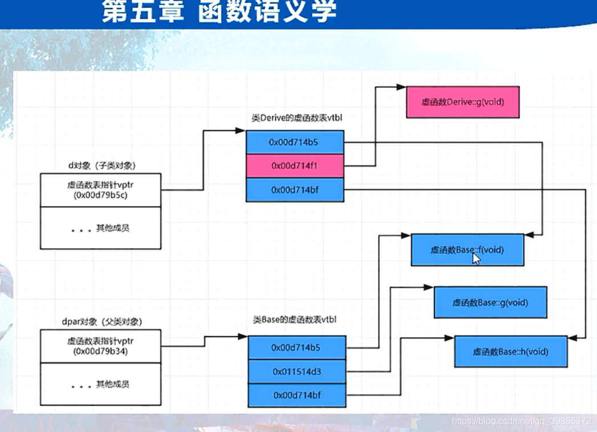
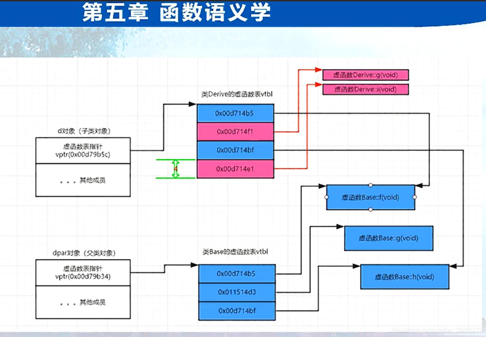

```c++
// project100.cpp : 此文件包含 "main" 函数。程序执行将在此处开始并结束。
//

#include "pch.h"
#include <iostream>
#include <time.h >
#include <stdio.h>
#include <vector>

using namespace std;

class Base
{
public:
	/*virtual void f() { cout << "Base::f()" << endl; }
	virtual void g() { cout << "Base::g()" << endl; }
	virtual void h() { cout << "Base::h()" << endl; }*/
	virtual void pvfunc() = 0;
};

class Derive :public Base {
public:
	//virtual void i() { cout << "Derive::i()" << endl; }
	//virtual void g() { cout << "Derive::g()" << endl; }
	//void myselffunc() {} //只属于Derive的函数
};
int main()
{
	//一：单继承下的虚函数
	/*Derive myderive;
	Derive *pmyderive = &myderive;
	pmyderive->f();
	pmyderive->g();
	pmyderive->h();
	pmyderive->i();*/

	//Base *pb = new Derive();  //基类指针 指向一个子类对象
	//pb->g();
	编译器视角
	(*pb->vptr[1])(pb);

	//Derive myderive;
	//Base &yb = myderive; //基类引用 引用 一个子类对象
	//yb.g();

	我们唯一需要在执行期间知道的东西就是 通过 哪个虚函数表来调用虚函数，（父类的还是子类的);

	二：回顾和一些小试验
	虚函数地址：编译期间知道,写在了可执行文件中,编译期间已经构建出来。
	vptr编译期间产生。编译器在构造函数中插入了给vptr赋值的代码；
	//当创建对象时，因为要执行对象的构造函数，此时vptr就被赋值；

	//Derive a1;
	//Derive a2;
	//Derive *pa3 = new Derive();

	//即使子类没有重写任何虚函数也还是会生成一张虚函数表
	//纯虚函数会在父类占一个表项
	
	//Base b1;

	cout << sizeof(Base) << endl;

	
	return 1;
}
 
```



