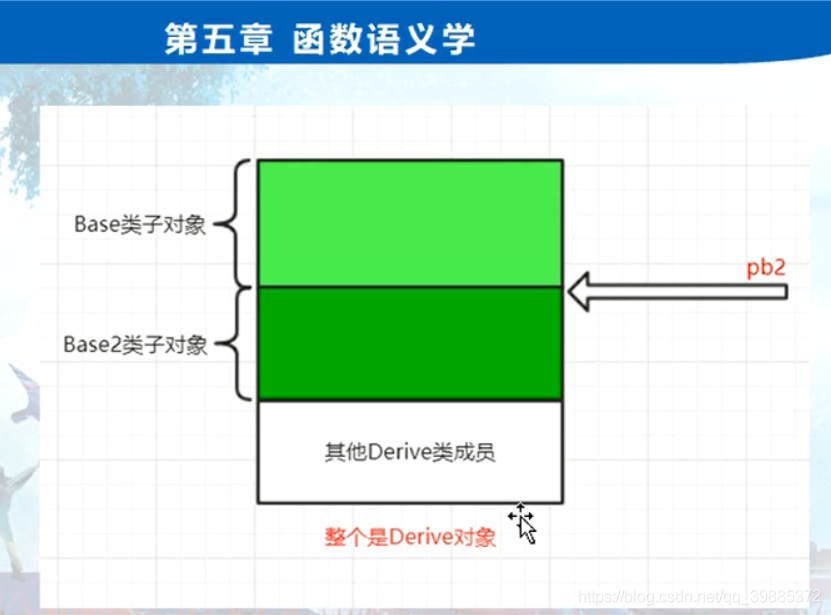
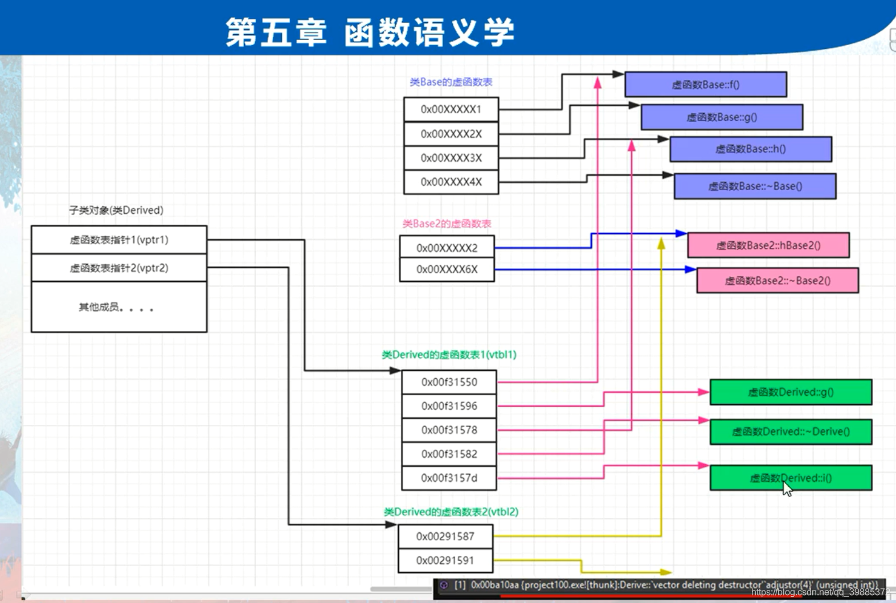
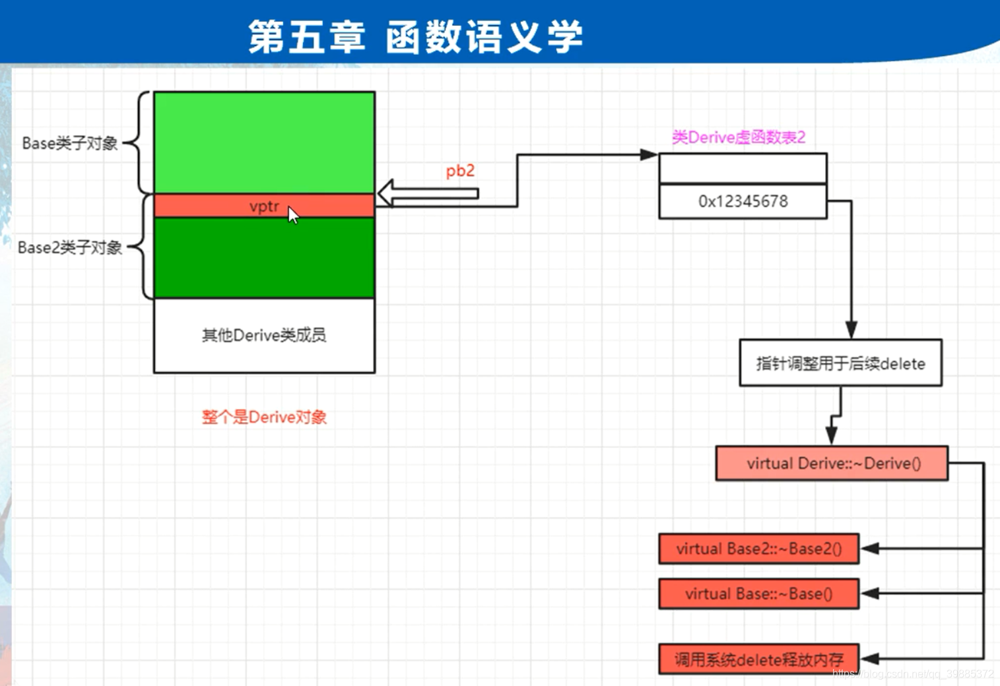

```c++
// project100.cpp : 此文件包含 "main" 函数。程序执行将在此处开始并结束。
//

#include "pch.h"
#include <iostream>
#include <time.h >
#include <stdio.h>
#include <vector>

using namespace std;

class Base
{
public:
	virtual void f() { cout << "Base::f()" << endl; }
	virtual void g() { cout << "Base::g()" << endl; }
	virtual void h() { cout << "Base::h()" << endl; }	

	virtual ~Base() {
		int abc;
		abc = 1;
	}

};

class Base2
{
public:
	virtual void hBase2() {

		cout << "Base2::hBase2()" << endl;
	}

	virtual ~Base2()	{
		int abc;
		abc = 1;
	}
};

class Derive :public Base,public Base2 {
public:
	virtual void i() { cout << "Derive::i()" << endl; }
	virtual void g() { cout << "Derive::g()" << endl; }
	void myselffunc() {} //只属于Derive的函数

	virtual ~Derive() {
		int abc;
		abc = 1;
	}	
};
int main()
{	
	//一：多继承下的虚函数
	//多重继承复杂性体现在后边这个基类上；
	Base2 *pb2 = new Derive();
	//编译器视角
	//Derive *temp = new Derive();
	//Base2 *pb2 = temp + sizeof(Base); // sizeof(Base) * sizeoeof(Base2);
	//Base2 *pb2 = (Base2 *)((char *)temp + sizeof(Base));
	
	delete pb2;

	//二：如何成功删除用第二基类指针new出来的继承类对象
	//a)我们要删除的实际是整个Derive()对象
	//b)要能够保证Derive()对象的析构函数被正常调用
	//c)编译器会调用Base2的析构函数，还是调用Derive的析构函数呢？
	//d)执行delte pb2时，系统的动作会是？
	  //d.1)如果Base2里没有析构函数,编译器会直接删除以pb2开头的这段内存，一定报异常，
	  		//因为这段内存压根就不是new起始的内存；
	  //d.2)如果Base2里有一个析构函数，但整个析构函数是个普通析构函数（非虚析构函数），那么当delte pb2，
	      //这个析构函数就会被系统调用,但是delete的仍旧是pb2开头这段内存，所以一定报异常。
	      //因为这段内存压根就不是new起始的内存；
	        //析构函数如果不是虚函数，编译器会实施静态绑定，静态绑定意味着你delete Base2指针时，
	        //删除的内存开始地址就是pb2的当前位置；所以肯定是错误的
	  //d.3)如果Base2里是一个虚析构函数，	
	     //~Dervice()
	        //~Base2()
	        //~Base()
	 //d.4)Derive里就就算没有虚析构函数，因为Base2里 有虚析构函数，编译器也会为此给Derive生成虚析构函数，
	 //为了调用~Base2()和~Base()虚析构函数；
	//e)老师要求大家，凡是涉及到继承的，所有类都要求大家些虚析构函数;

	Base *pbm = new Base();
	Base2 *pb222 = new Base2();
	Derive *p11212 = new Derive();

	p11212->g();
	p11212->i(); //走虚函数表

	Derive dddd;
	dddd.i(); //直接调用虚函数

	//Derive 类的第二个虚函数表中发现了thunk字样：
	//一般这玩意用在多重继承中（从第二个虚函数表开始可能就 会有）；用于this指针调整。这玩意其实是一段汇编代码，这段代码干两个事情：
	//(1)调整this指针
	//(2)调用Derive析构函数


	
	return 1;
}
 

```

# delete第二基类指针时调用关系

```c++
delete pb2;

00F230BD  call        edx 
00F210AA  jmp         Derive::`vector deleting destructor' (0F22878h)  

00F22878  sub         ecx,4   调整this指针,指向了Derive对象首地址 **********************
00F2287B  jmp         Derive::`vector deleting destructor' (0F210D2h) 
00F210D2  jmp         Derive::`scalar deleting destructor' (0F22970h)
00F22996  call          Derive::~Derive (0F2141Ah)  
00F2141A  jmp         Derive::~Derive (0F22580h)  
    00F225EC  call         Base2::~Base2 (0F212DFh)
    00F225F4  call         Base::~Base (0F212E9h) 
00F229A9  call        operator delete (0F212EEh) 


```





