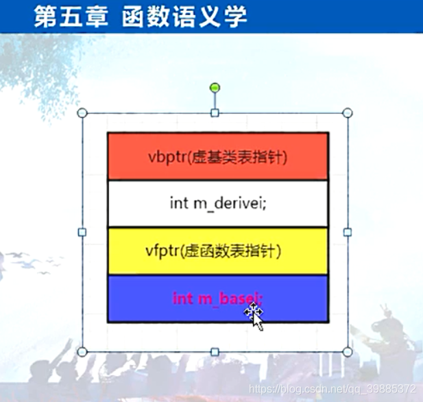
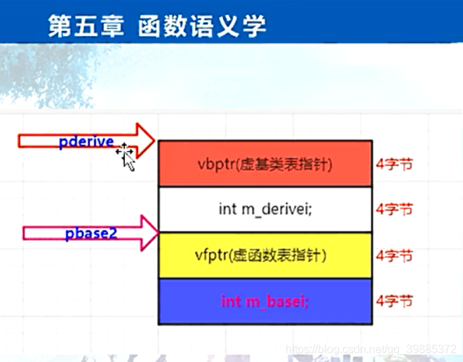

```c++
// project100.cpp : 此文件包含 "main" 函数。程序执行将在此处开始并结束。
//

#include "pch.h"
#include <iostream>
#include <time.h >
#include <stdio.h>
#include <vector>

using namespace std;
//
//class Base
//{
//public:
//	virtual void f() { cout << "Base::f()" << endl; }
//	virtual void g() { cout << "Base::g()" << endl; }
//	virtual void h() { cout << "Base::h()" << endl; }	
//
//	virtual ~Base() {
//		
//	}
//
//	virtual Base *clone() const
//	{
//		return new Base();
//	}
//
//};
//
//class Base2
//{
//public:
//	virtual void hBase2() {
//
//		cout << "Base2::hBase2()" << endl;
//	}
//
//	virtual ~Base2()	{
//	
//	}
//
//	virtual Base2 *clone() const
//	{
//		return new Base2();
//	}
//};
//
//class Derive :public Base,public Base2 {
//public:
//	virtual void i() { cout << "Derive::i()" << endl; }
//	virtual void g() { cout << "Derive::g()" << endl; }
//	void myselffunc() {} //只属于Derive的函数
//
//	virtual ~Derive() {
//		
//	}	
//	virtual Derive *clone() const
//	{
//		return new Derive();
//	}
//};

class Base
{
public:
	virtual void f() {}
	virtual ~Base() {}
	int m_basei;
};

class Derive :public virtual Base
{
public:
	virtual ~Derive(){}
	int m_derivei;
};

int main()
{	
	//一：多重继承第二基类对虚函数支持的影响（this指针调整作用）
	//子类继承了几个父类，子类就有几个虚函数表

	//多重继承下，有几种情况，第二个或者后续的基类会对虚函数的支持产生影响
	//this指针调整,调整的目的是干什么？
	//this指针调整的目的就是让对象指针正确的指向对象首地址，从而能正确的调用对象的成员函数或者说正确确定数据成员的存储位置。
	
	//this指针调整情况：
	//a)通过指向第二个基类的指针调用继承类的虚函数；
	//Base2 *pb2 = new Derive();
	//delete pb2; //调用继承类的虚析构函数

	b)一个指向派生类的指针，调用第二个基类中的虚函数
	//Derive *pd2 = new Derive();
	//pd2->hBase2();

	c)允许虚函数的返回值类型有所变化
	//Base2 *pb1 = new Derive(); //pb1指向的是Base2子对象的首地址
	//Base2 *pb2 = pb1->clone(); //Derive::clone();
	//         //执行clone()时，pb1首先会调整回指向Derivce对象的首地址，这样调用的是Derive版本的clone()
	//            

	//二： 虚继承下的虚函数
	//cout << sizeof(Derive) << endl;  //16
	//Derive dobj;
	//dobj.m_basei = 2;
	//dobj.m_derivei = 5;

	//Derive *pdobj = new Derive();
	//pdobj->f();//寄存器窗口看F地址，再通过反汇编内存窗口找出虚函数表地址

	/*Base *pbase = new Derive();
	pbase->m_basei = 6;*/

	Derive *pderive = new Derive();
	Base *pbase2 = (Base *)pderive;
	pbase2->m_basei = 7;


	
	return 1;
}
```



