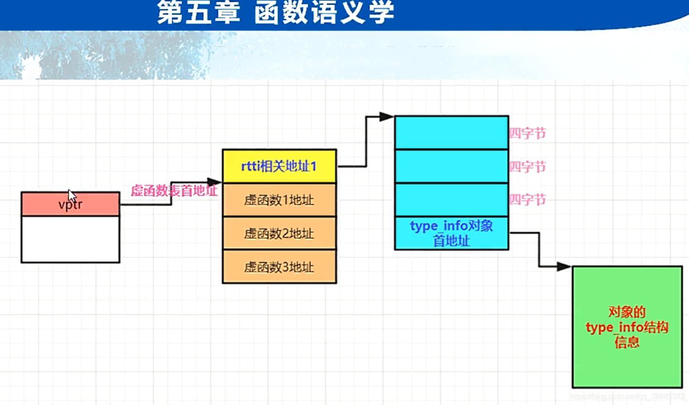
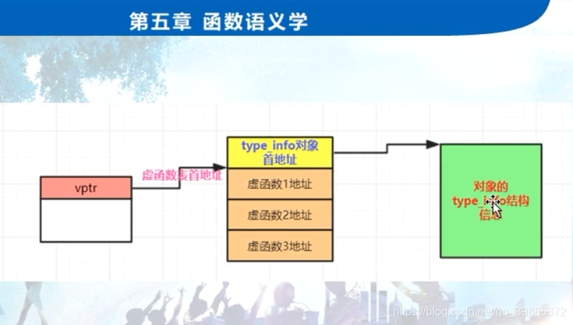

```c++
// project100.cpp : 此文件包含 "main" 函数。程序执行将在此处开始并结束。
//

#include "pch.h"
#include <iostream>
#include <time.h >
#include <stdio.h>
#include <vector>

using namespace std;

class Base
{
public:
	virtual void f() { cout << "Base::f()" << endl; }
	virtual void g() { cout << "Base::g()" << endl; }
	virtual void h() { cout << "Base::h()" << endl; }	
	virtual ~Base() {}	
};

class Derive :public Base {
public:	
	virtual void g() { cout << "Derive::g()" << endl; }
	void myselffunc() {} //只属于Derive的函数
	virtual ~Derive() {}
};

int main()
{	
	//一：RTTI（运行时类型识别）简单回顾
	Base *pb = new Derive(); 
	pb->g();

	Derive myderive;
	Base &yb = myderive;
	yb.g();

	//c++运行时类型识别RTTI，要求父类中必须至少有一个虚函数；如果父类中没有虚函数，那么得到RTTI就不准确；
	//RTTI就可以在执行期间查询一个多态指针，或者多态引用的信息了；
	//RTTI能力靠typeid和dynamic_cast运算符来体现；
	cout << typeid(*pb).name() << endl;
	cout << typeid(yb).name() << endl;

	Derive *pderive = dynamic_cast<Derive *>(pb);
	if (pderive != NULL)
	{
		cout << "pb实际是一个Derive类型" << endl;
		pderive->myselffunc(); //调用自己专属函数
	}

	//二：RTTI实现原理
	//typeid返回的是一个常量对象的引用，这个常量对象的类型一般是type_info（类）；
	const std::type_info &tp = typeid(*pb);
	Base *pb2 = new Derive();
	Base *pb3 = new Derive();
	const std::type_info &tp2 = typeid(*pb2);
	const std::type_info &tp3 = typeid(*pb3);


	cout << typeid(int).name();

	if (tp == tp2)
	{
		cout << "很好，类型相同" << endl;
	}

	//其他用法，静态类型；不属于多态类型
	/*cout << typeid(int).name() << endl;
	cout << typeid(Base).name() << endl;
	cout << typeid(Derive).name() << endl;
	Derive *pa3 = new Derive();
	cout << typeid(pa3).name();*/

	//Base *pb = new Derive();
	//Derive myderive;
	//Base &yb = myderive;
	//cout << typeid(*pb).name() << endl; //class Derive
	//cout << typeid(yb).name() << endl; //class Derive
	//Base *pb2 = new Derive();
	//const std::type_info &tp2 = typeid(*pb2);

	//RTTI的测试能力跟基类中是否u才能在虚函数表有关系，如果基类中没有虚函数，也就不存在基类的虚函数表，RTTI就无法得到正确结果；

	printf("tp2地址为:%p\n", &tp2);
	long *pvptr = (long *)pb2;
	long *vptr = (long *)(*pvptr);
	printf("虚函数表首地址为:%p\n", vptr);
	printf("虚函数表首地址之前一个地址为:%p\n", vptr-1); //这里的-1实际上是往上走了4个字节

	long *prttiinfo = (long *)(*(vptr - 1));
	prttiinfo += 3; //跳过12字节
	long * ptypeinfoaddr = (long *)(*prttiinfo);
	const std::type_info *ptypeinfoaddrreal = (const std::type_info *)ptypeinfoaddr;
	printf("ptypeinfoaddrreal地址为:%p\n", ptypeinfoaddrreal);
	cout << ptypeinfoaddrreal->name() << endl; 


	//三：vptr,vtbl,rtti的type_info信息 构造时机
	//rtti的type_info信息:编译后就存在了；写到了可执行文件中,也是跟着类走的

	//总结一下：各个编译器实现有一定差异，但总体都是以虚函数表开始地址为突破口；

	
	return 1;
}
```



