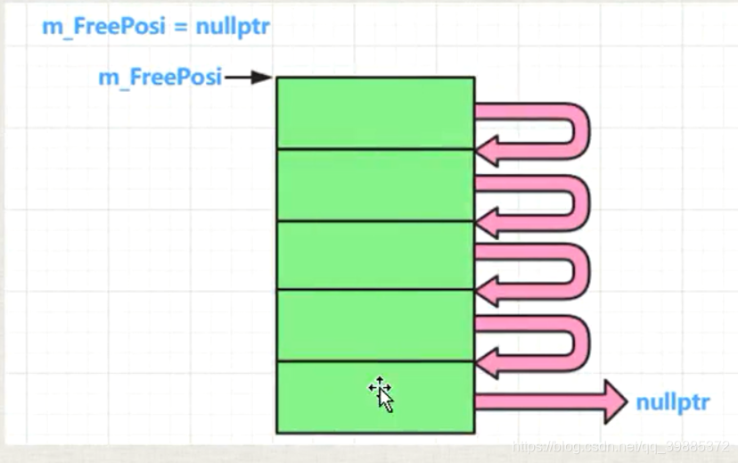
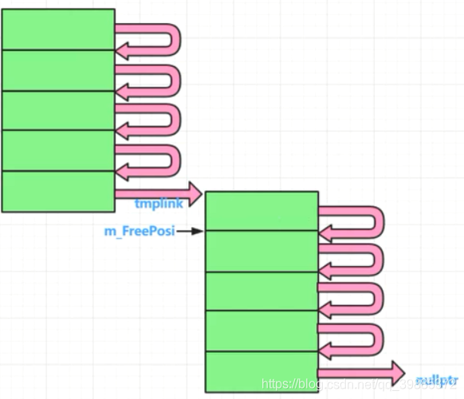
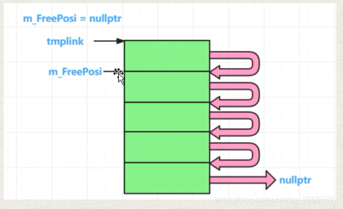
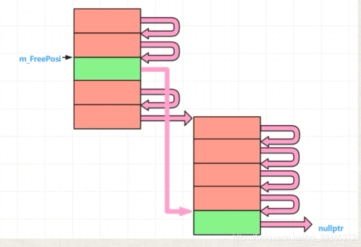
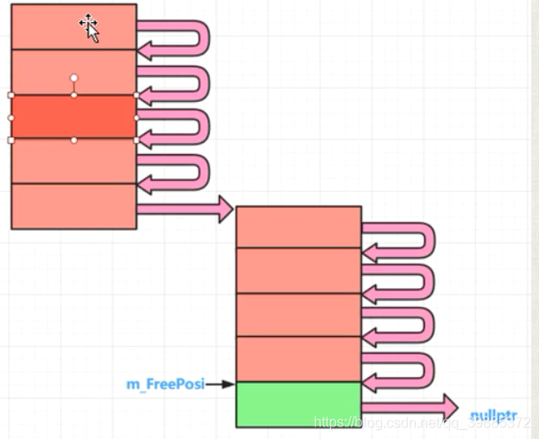

```c++

#include "pch.h"
#include <iostream>
#include <vector>
#include <ctime>
using namespace std;

namespace _nmsp1 //命名空间
{	
	//一：内存池的概念和实现原理概述
	//malloc：内存浪费，频繁分配小块内存，则浪费更加显得明显
	//“内存池”，要解决什么问题？
	//(1)减少malloc的次数，减少malloc()调用次数就意味着减少对内存的浪费
	//(2)减少malloc的调用次数，是否能够提高程序运行效率？ 会有一些速度和效率上的提升，但是提升不明显；
	//“内存池的实现原理”：
	//(1)用malloc申请一大块内存，当你要分配的时候，我从这一大块内存中一点一点的分配给你，当一大块内存分配的差不多的时候，我
	   //再用malloc再申请一大块内存，然后再一点一点的分配给你；

	//减少内存浪费，提高运行效率；

	void func()
	{
		
		
	}
}
namespace _nmsp2 
{
#define MYMEMPOOL 1

	//二：针对一个类的内存池实现演示代码
	//针对一个类的内存池 A,
	//A *pa = new A() ,delete pa; 用内存池的手段实现new,delete一个对象；

	//三：内存池代码后续说明


	class A
	{
	public:
		static void *operator new(size_t size);
		static void operator delete(void *phead);
		static int m_iCout; //分配计数统计，每new一次，就统计一次
		static int m_iMallocCount; //每malloc一次，我统计一次
	private:
		A *next;
		static A* m_FreePosi; //总是指向一块可以分配出去的内存的首地址
		static int m_sTrunkCout; //一次分配多少倍的该类内存
	};
	int A::m_iCout = 0;
	int A::m_iMallocCount = 0;
	A *A::m_FreePosi = nullptr;
	int A::m_sTrunkCout = 5; //一次分配5倍的该类内存作为内存池子的大小

	void *A::operator new(size_t size)
	{
		#ifdef MYMEMPOOL
				A *ppoint = (A*)malloc(size);
				return ppoint;
		#endif
		A *tmplink;
		if (m_FreePosi == nullptr)
		{
			//为空，我要申请内存，要申请一大块内存
			size_t realsize = m_sTrunkCout * size; //申请m_sTrunkCout这么多倍的内存
			m_FreePosi = reinterpret_cast<A*>(new char[realsize]); //传统new(全局new不是new类)，调用的系统底层的malloc
			tmplink = m_FreePosi; 

			//把分配出来的这一大块内存（5小块），彼此要链起来，供后续使用
			for (; tmplink != &m_FreePosi[m_sTrunkCout - 1]; ++tmplink)
			{
				tmplink->next = tmplink + 1;
			}
			tmplink->next = nullptr;
			++m_iMallocCount;
		}
		tmplink = m_FreePosi;
		m_FreePosi = m_FreePosi->next;
		++m_iCout;
		return tmplink;
	}
	void A::operator delete(void *phead)
	{
		#ifdef MYMEMPOOL
				free(phead);
				return;
		#endif
		(static_cast<A*>(phead))->next = m_FreePosi;
		m_FreePosi = static_cast<A*>(phead);
	}

	void func()
	{
		clock_t start, end; //包含头文件 #include <ctime>
		start = clock();
		//for (int i = 0; i < 500'0000; i++)
		for (int i = 0; i < 15; i++)
		{
			A *pa = new A();
			printf("%p\n", pa);
		}
		end = clock();
		cout << "申请分配内存的次数为：" << A::m_iCout << " 实际malloc的次数为：" << A::m_iMallocCount << " 用时(毫秒): " << end - start << endl;
	}
}

int main()
{	
	//_nmsp1::func();	
	_nmsp2::func();
	return 1;
}
```











