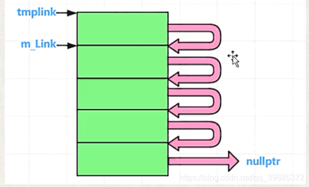
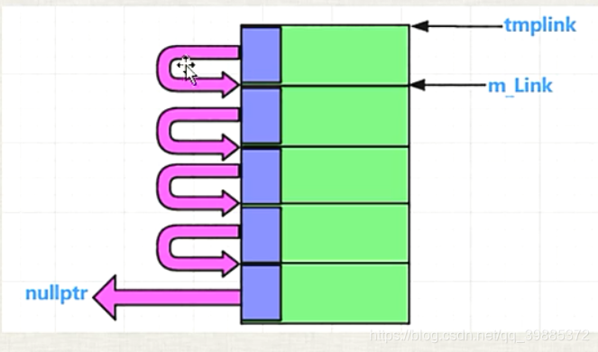
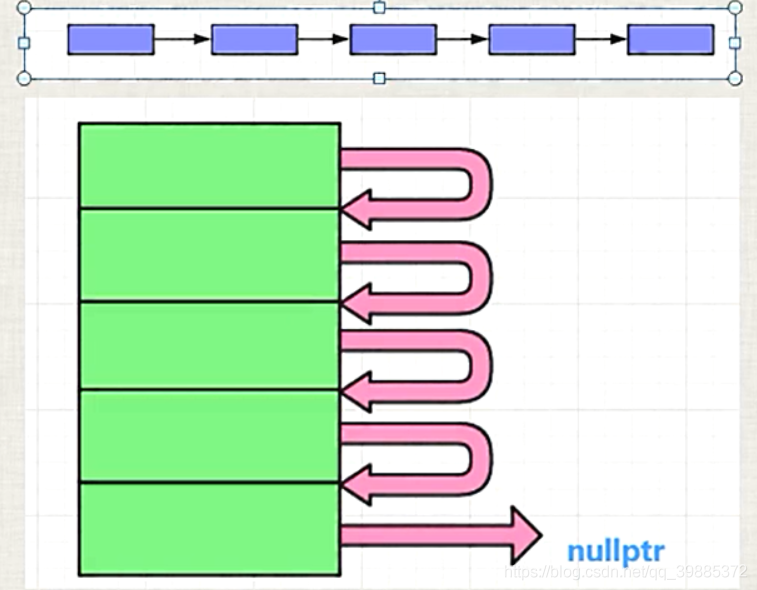

```c++

#include "pch.h"
#include <iostream>
#include <vector>
#include <ctime>
using namespace std;

namespace _nmsp1 //命名空间
{	
	//一：内存池的概念和实现原理概述
	//malloc：内存浪费，频繁分配小块内存，则浪费更加显得明显
	//“内存池”，要解决什么问题？
	//(1)减少malloc的次数，减少malloc()调用次数就意味着减少对内存的浪费
	//(2)减少malloc的调用次数，是否能够提高程序运行效率？ 会有一些速度和效率上的提升，但是提升不明显；
	//“内存池的实现原理”：
	//(1)用malloc申请一大块内存，当你要分配的时候，我从这一大块内存中一点一点的分配给你，
	//当一大块内存分配的差不多的时候，我再用malloc再申请一大块内存，然后再一点一点的分配给你；

	//减少内存浪费，提高运行效率；

	void func()
	{
		
		
	}
}
namespace _nmsp2 
{
//#define MYMEMPOOL 1

	//二：针对一个类的内存池实现演示代码
	//针对一个类的内存池 A,
	//A *pa = new A() ,delete pa; 用内存池的手段实现new,delete一个对象；

	//三：内存池代码后续说明


	class A
	{	
	public:	
		int m_i;
		int m_j;

		static void *operator new(size_t size);
		static void operator delete(void *phead);
		static int m_iCout; //分配计数统计，每new一次，就统计一次
		static int m_iMallocCount; //每malloc一次，我统计一次
	private:
		A *next;
		static A* m_FreePosi; //总是指向一块可以分配出去的内存的首地址
		static int m_sTrunkCout; //一次分配多少倍的该类内存
	};
	int A::m_iCout = 0;
	int A::m_iMallocCount = 0;
	A *A::m_FreePosi = nullptr;
	int A::m_sTrunkCout = 5; //一次分配5倍的该类内存作为内存池子的大小

	void *A::operator new(size_t size)
	{
#ifdef MYMEMPOOL
		A *ppoint = (A*)malloc(size);
		return ppoint;
#endif
		A *tmplink;
		if (m_FreePosi == nullptr)
		{
			//为空，我要申请内存，要申请一大块内存
			size_t realsize = m_sTrunkCout * size; //申请m_sTrunkCout这么多倍的内存
			m_FreePosi = reinterpret_cast<A*>(new char[realsize]); //传统new，调用的系统底层的malloc
			tmplink = m_FreePosi; 

			//把分配出来的这一大块内存（5小块），彼此要链起来，供后续使用
			for (; tmplink != &m_FreePosi[m_sTrunkCout - 1]; ++tmplink)
			{
				tmplink->next = tmplink + 1;
			}
			tmplink->next = nullptr;
			++m_iMallocCount;
		}
		tmplink = m_FreePosi;
		m_FreePosi = m_FreePosi->next;
		++m_iCout;
		return tmplink;
	}
	void A::operator delete(void *phead)
	{
#ifdef MYMEMPOOL
		free(phead);
		return;
#endif
		(static_cast<A*>(phead))->next = m_FreePosi;
		m_FreePosi = static_cast<A*>(phead);
	}

	void func()
	{
		clock_t start, end; //包含头文件 #include <ctime>
		start = clock();
		//for (int i = 0; i < 500'0000; i++)
		for (int i = 0; i < 15; i++)
		{
			A *pa = new A();
			printf("%p\n", pa);
		}
		end = clock();
		cout << "申请分配内存的次数为：" << A::m_iCout << " 实际malloc的次数为：" 
		<< A::m_iMallocCount << " 用时(毫秒): " << end - start << endl;
	}
}

namespace _nmsp3
{
	//一：嵌入式指针（embedded pointer)
	//（1.1）嵌入式指针概念
	//一般应用在内存池相关的代码中；    成功使用嵌入式指针有个前提条件：（类A对象的sizeof必须不小于4字节）
	//嵌入式指针工作原理：借用A对象所占用的内存空间中的前4个字节，这4个字节用来 链住这些空闲的内存块；
	//但是，一旦某一块被分配出去，那么这个块的 前4个字节 就不再需要，此时这4个字节可以被正常使用；
	//（1.2）嵌入式指针演示代码
	//sizeof()超过4字节的类就可以安全的使用嵌入式指针，因为，在当前的vs2017环境下，指针的sizeof值是4
	   
	class TestEP
	{
	public:
		int m_i;
		int m_j;

	public:
		struct obj //结构
		{
			//成员，是个指针
			struct obj *next;  //这个next就是个嵌入式指针
//自己是一个obj结构对象，那么把自己这个对象的next指针指向 另外一个obj结构对象，
//最终，把多个自己这种类型的对象通过链串起来；

		};
	};
	void func()
	{
		TestEP mytest;
		cout << sizeof(mytest) << endl; //8
		TestEP::obj *ptemp;  //定义一个指针
		//把对象mytest首地址给了这个指针ptemp，这个指针ptemp指向对象mytest首地址；
		ptemp = (TestEP::obj *)&mytest; 
		cout << sizeof(ptemp->next) << endl; //4
		cout << sizeof(TestEP::obj) << endl; //4
		ptemp->next = nullptr;	//ptemp和ptemp.next共用同个地址，所以next为空就是ptemp为空

	}
}

//______________________用嵌入式指针进一步内存池优化空间代码___________________________
namespace _nmsp4
{
	//二：内存池代码的改进
	//单独的为内存池技术来写一个类


	//专门的内存池类
	class myallocator //必须保证应用本类的类的sizeof()不少于4字节；否则会崩溃或者报错；
	{
	public:
		//分配内存接口
		void *allocate(size_t size)
		{
			obj *tmplink;
			if (m_FreePosi == nullptr)
			{
				//为空，我要申请内存，要申请一大块内存
				size_t realsize = m_sTrunkCout * size; //申请m_sTrunkCout这么多倍的内存
				m_FreePosi = (obj *)malloc(realsize);
				tmplink = m_FreePosi;

				//把分配出来的这一大块内存（5小块），彼此用链起来，供后续使用
				for (int i = 0; i < m_sTrunkCout - 1; ++i) //0--3
				{
					tmplink->next = (obj *)((char *)tmplink + size);
					tmplink = tmplink->next;
				} //end for
				tmplink->next = nullptr;
			} //end if
			tmplink = m_FreePosi;
			m_FreePosi = m_FreePosi->next;
			return tmplink;
		}
		//释放内存接口
		void deallocate(void *phead)
		{
			((obj *)phead)->next = m_FreePosi;
			m_FreePosi = (obj *)phead;
		}
	private:
		//写在类内的结构，这样只让其在类内使用
		struct obj
		{
			struct obj *next; //这个next就是个嵌入式指针
		};
		int m_sTrunkCout = 5;//一次分配5倍的该类内存作为内存池子的大小
		obj* m_FreePosi = nullptr;
	};

//------------------------
#define DECLARE_POOL_ALLOC()\
public:\
	static myallocator myalloc;\
	static void *operator new(size_t size)\
	{\
		return myalloc.allocate(size);\
	}\
	static void operator delete(void *phead)\
	{\
		return myalloc.deallocate(phead);\
	}\
//-----------
#define IMPLEMENT_POOL_ALLOC(classname)\
myallocator classname::myalloc;
//---------------
	class A
	{
		DECLARE_POOL_ALLOC()

	public:
		int m_i;
		int m_j; //为了保证sizeof(A)凑够4字节，老师演示时定义了两个int成员变量；	
	};
	IMPLEMENT_POOL_ALLOC(A)	
	
	void func()
	{
		A *mypa[100];
		for (int i = 0; i < 15; ++i)
		{
			mypa[i] = new A();
			mypa[i]->m_i = 12;
			mypa[i]->m_j = 15;

			printf("%p\n", mypa[i]);
		}
		for (int i = 0; i < 15; ++i)
		{
			delete mypa[i];
		}

	}
}

int main()
{	
	//_nmsp1::func();	
	//_nmsp2::func();
	//_nmsp3::func();
	_nmsp4::func();

	return 1;
}
```








