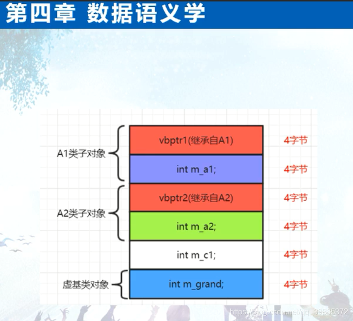
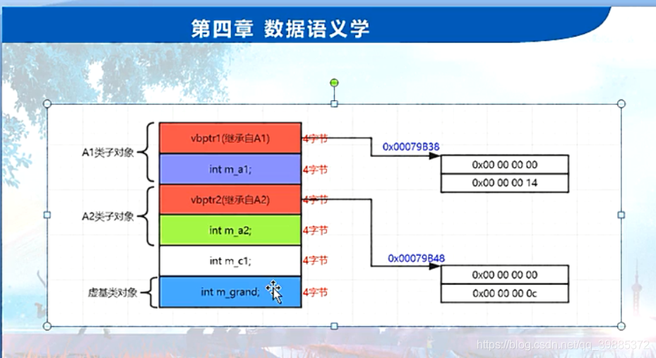
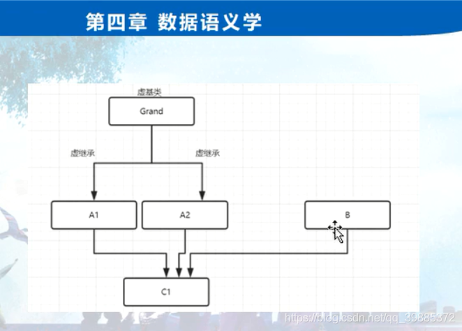

```c++
// project100.cpp : 此文件包含 "main" 函数。程序执行将在此处开始并结束。
//

#include "pch.h"
#include <iostream>
#include <time.h >
#include <stdio.h>
#include <vector>

using namespace std;

class Grand //爷爷类
{
public:
	int m_grand;
};

class A1 : virtual public Grand
{
public:
	int m_a1;
};

class A2 : virtual public Grand
{
public:
	int m_a2;
};

class C1 :public A1, public A2
{
public:
	int m_c1;
};

int main()
{	
	//一：三层结构时虚基类表内容分析
	cout << sizeof(Grand) << endl;
	cout << sizeof(A1) << endl;
	cout << sizeof(A2) << endl;
	cout << sizeof(C1) << endl;

	//A1 a1obj;
	//a1obj.m_grand = 2;
	//a1obj.m_grand2 = 6;
	a1obj.m_grand2_1 = 7;
	//a1obj.m_a1 = 5;

	C1 c1obj;
	c1obj.m_grand = 2;
	c1obj.m_a1 = 5;
	c1obj.m_a2 = 6;
	c1obj.m_c1 = 8;
	//C1 c2obj;

	//没有用到vbptr2，只用到了vbptr1

	//二：虚基类为什么这么设计
	//为什么这么设计，是个很难回答的问题；
	//A2 *pobja2 = new C1();  
	A2 *pa2 = &c1obj;
	pa2->m_grand = 8;
	pa2->m_a2 = 9;


	return 1;
}
```





