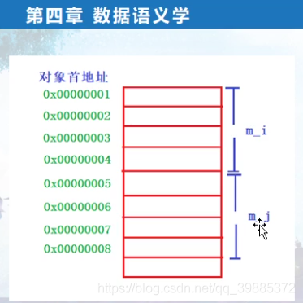

```c++
// project100.cpp : 此文件包含 "main" 函数。程序执行将在此处开始并结束。
//

#include "pch.h"
#include <iostream>
#include <time.h >
#include <stdio.h>
using namespace std;

class FAC
{
public:
	int m_fai;
	int m_faj;
};
class MYACLS : public FAC
{
public:
	int m_i;
	static int m_si; //声明而不是定义
	int m_j;

	void myfunc()
	{
		m_i = 5;
		m_j = 6;
	}
};

int MYACLS::m_si = 10; //这个是定义


int main()
{	
	//一：静态成员变量的存取
	//静态成员变量，可以当做一个全局量，但是他只在类的空间内可见；引用时用 类名::静态成员变量名
	//静态成员变量只有一个实体，保存在可执行文件的数据段的；

	MYACLS myobj;
	MYACLS *pmyobj = new MYACLS();

	/*cout << MYACLS::m_si << endl;
	cout << myobj.m_si << endl;
	cout << pmyobj->m_si << endl;*/
	MYACLS::m_si = 1;
	myobj.m_si = 2;
	pmyobj->m_si = 3;

	printf("myobj.m_i = %p\n", &myobj.m_i);
	printf("pmyobj->m_i = %p\n", &pmyobj->m_i);

	printf("MYACLS::m_si = %p\n", &MYACLS::m_si);
	printf("myobj.m_si = %p\n", &myobj.m_si);
	printf("pmyobj->m_si = %p\n", &pmyobj->m_si);

	//二：非静态成员变量的存取（普通的成员变量），存放在类的对象中。存取通过类对象（类对象指针）

	//pmyobj->myfunc();
	//编译器角度：MYACLS::myfunc(pmyobj)
	//MYACLS::myfunc(MYACLS *const this)
	//{
		//this->m_i = 5;
		//this->m_j = 5;
	//}
	//对于普通成员的访问，编译器是把类对象的首地址加上成员变量的偏移值；
	// &myobj + 4  = &myobj.m_j
	printf("MYACLS::m_i = %d\n", &MYACLS::m_i);
	printf("MYACLS::m_j = %d\n", &MYACLS::m_j);

	pmyobj->myfunc();
	pmyobj->m_faj = 7;

	//虚基类；
	myobj.m_i = 15;
	pmyobj->m_i;

	   	 
	return 1;
}

```



静态成员变量的存取
静态成员变量，可以当做一个全局量，但是它只在类的空间内可见【也就是在使用静态成员变量时，要在前面加一个(类名::)】
而且，静态成员变量只有一个实体，保存在可执行文件的数据段
静态成员变量的引用可以使用类名【A::m_s】，也可以使用对象名【a.m_s】和对象指针【pa->m_s】

非静态成员变量的存取（普通的成员变量），存放在类的对象中，存取通过类对象，类对象指针

对于普通成员变量的访问，编译器是把类对象的首地址 + 成员变量的偏移值【成员变量偏移几个，这种东西是已经在编译期间就算出来的，所以这种查找存取效率非常高】
