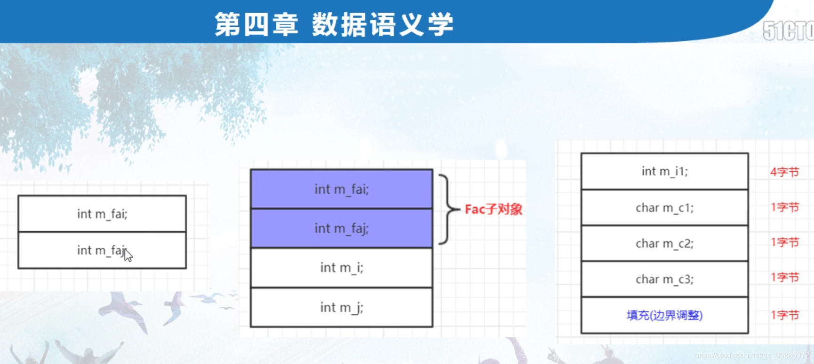
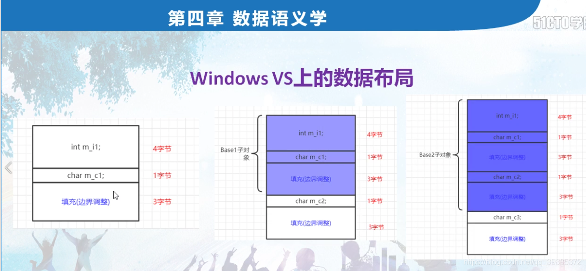
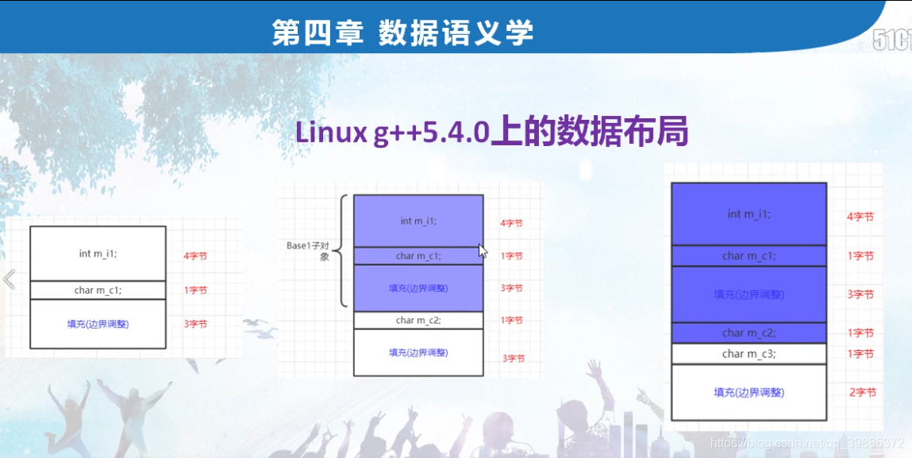

```c++
// project100.cpp : 此文件包含 "main" 函数。程序执行将在此处开始并结束。
//

#include "pch.h"
#include <iostream>
#include <time.h >
#include <stdio.h>
using namespace std;

//class FAC //父类
//{
//public:
//	int m_fai;
//	int m_faj;
//};
//class MYACLS :public FAC //子类
//{
//public:
//	int m_i;
//	int m_j;
//};

//class Base //sizeof = 8字节；
//{
//public:
//	int m_i1;
//	char m_c1;
//	char m_c2;
//	char m_c3;
//};

class Base1
{
public:
	int m_i1;
	char m_c1;
};
class Base2 :public Base1
{
public:
	char m_c2;
};
class Base3 :public Base2
{
public:
	char m_c3;
};


int main()
{		
	//第五节  单一继承下的数据成员布局
	//printf("FAC::m_fai = %d\n", &FAC::m_fai);
	//printf("FAC::m_faj = %d\n", &FAC::m_faj);

	//printf("MYACLS::m_fai = %d\n", &MYACLS::m_fai);
	//printf("MYACLS::m_faj = %d\n", &MYACLS::m_faj);
	//
	//printf("MYACLS::m_i = %d\n", &MYACLS::m_i);
	//printf("MYACLS::m_j = %d\n", &MYACLS::m_j);

	(1)一个子类对象，所包含的内容，是他自己的成员，加上他父类的成员的总和；
	(2)从偏移值看，父类成员先出现，然后才是孩子类成员。
	//FAC facobj;
	//MYACLS myaclobj; //子类对象中实际上是包含着父类子对象的

	/*cout << sizeof(Base) << endl;   //8字节，数据布局（内存排列上）紧凑；
	printf("Base::m_i1 = %d\n", &Base::m_i1);
	printf("Base::m_c1 = %d\n", &Base::m_c1);
	printf("Base::m_c2 = %d\n", &Base::m_c2);
	printf("Base::m_c3 = %d\n", &Base::m_c3);*/

	//引入继承关系后，可能会带来内存空间的额外增加。

	cout << sizeof(Base1) << endl; //8
	cout << sizeof(Base2) << endl; //12
	cout << sizeof(Base3) << endl; //16
	printf("Base3::m_mi1 = %d\n", &Base3::m_i1);
	printf("Base3::m_mc1 = %d\n", &Base3::m_c1);
	printf("Base3::m_mc2 = %d\n", &Base3::m_c2);
	printf("Base3::m_mc3 = %d\n", &Base3::m_c3);

	//linux上windows上数据布局不一样，说明：
	//a)编译器在不断的进步和优化；
	//b)不同厂商编译器，实现细节也不一样；
	//c)内存拷贝就要谨慎；

	Base2 mybase2obj;
	Base3 mybase3obj;
	//你就不能用memcpy内存拷贝把Base2内容直接Base3里拷贝；


	
	return 1;
}

```







```c++
#include <stdio.h>
#include <iostream>
#include <string>

using namespace std;

class FAC
{
public:
    int m_fai;
    int m_faj;
};

class MYACLS : public FAC
{
public:
    int m_i;
    int m_j;
};

class BASE
{
public:
    int m_i1;       // 4字节
    char m_c1;      // 1字节
    char m_c2;      // 1字节
    char m_c3;      // 1字节
};

class BASE1
{
public:
    int m_i1;
    char m_c1;
};

class BASE2 : public BASE1
{
public:
    char m_c2;
};

class BASE3 : public BASE2
{
public:
    char m_c3;
};

int main()
{
    // 单一继承下的数据成员布局
    std::cout << "父类数据成员偏移值" << std::endl;
    std::cout << "FAC::m_fai = " << (size_t)&(((FAC*)0)->m_fai) << std::endl;
    std::cout << "FAC::m_faj = " << (size_t)&(((FAC*)0)->m_faj) << std::endl;
    
    std::cout << "子类继承的父类成员偏移值" << std::endl;
    std::cout << "MYACLS::m_fai = " << (size_t)&(((MYACLS*)0)->m_fai) << std::endl;
    std::cout << "MYACLS::m_faj = " << (size_t)&(((MYACLS*)0)->m_faj) << std::endl;
    
    std::cout << "子类数据成员偏移值" << std::endl;
    std::cout << "MYACLS::m_i = " << (size_t)&(((MYACLS*)0)->m_i) << std::endl;
    std::cout << "MYACLS::m_j = " << (size_t)&(((MYACLS*)0)->m_j) << std::endl;
    
    // FAC::m_fai = 0
    // FAC::m_faj = 4
    // 子类继承的父类成员偏移值
    // MYACLS::m_fai = 0
    // MYACLS::m_faj = 4
    // 子类数据成员偏�值
    // MYACLS::m_i = 8
    // MYACLS::m_j = 12
    
    // 结论
    // 1）一个子类对象，所包含的内容，是它自己的成员，加上父类的成员的总和
    // 2）从偏移值来看，父类成员先出现，而且是按照定义时的顺序出现，然后才是子类成员
    
    FAC faobj;
    MYACLS myacobj; // 子类对象中实际上是包含着父类子对象的
    
    std::cout << "BASE数据成员偏移量" << std::endl;
    std::cout << "BASE 内存大小 = " << sizeof(BASE) << std::endl;     // 8字节（因为边界调整，7 -> 8）
    std::cout << "BASE::m_i1 = " << (size_t)&(((BASE*)0)->m_i1) << std::endl;
    std::cout << "BASE::m_c1 = " << (size_t)&(((BASE*)0)->m_c1) << std::endl;
    std::cout << "BASE::m_c2 = " << (size_t)&(((BASE*)0)->m_c2) << std::endl;
    std::cout << "BASE::m_c3 = " << (size_t)&(((BASE*)0)->m_c3) << std::endl;
    
    // BASE数据成员偏移量
    // 8
    // BASE::m_i1 = 0
    // BASE::m_c1 = 4
    // BASE::m_c2 = 5
    // BASE::m_c3 = 6
    
    std::cout << "BASE1 内存大小 = " << sizeof(BASE1) << std::endl;
    std::cout << "BASE2 内存大小 = " << sizeof(BASE2) << std::endl;
    std::cout << "BASE3 内存大小 = " << sizeof(BASE3) << std::endl;
    std::cout << "引入继承关系后的内存布局" << std::endl;
    std::cout << "BASE1::m_i1 = " << (size_t)&(((BASE1*)0)->m_i1) << std::endl;
    std::cout << "BASE1::m_c1 = " << (size_t)&(((BASE1*)0)->m_c1) << std::endl;
    std::cout << "*******" << std::endl;
    std::cout << "BASE2::m_i1 = " << (size_t)&(((BASE2*)0)->m_i1) << std::endl;
    std::cout << "BASE2::m_c1 = " << (size_t)&(((BASE2*)0)->m_c1) << std::endl;
    std::cout << "BASE2::m_c2 = " << (size_t)&(((BASE2*)0)->m_c2) << std::endl;
    std::cout << "*******" << std::endl;
    std::cout << "BASE3::m_i1 = " << (size_t)&(((BASE3*)0)->m_i1) << std::endl;
    std::cout << "BASE3::m_c1 = " << (size_t)&(((BASE3*)0)->m_c1) << std::endl;
    std::cout << "BASE3::m_c2 = " << (size_t)&(((BASE3*)0)->m_c2) << std::endl;
    std::cout << "BASE3::m_c3 = " << (size_t)&(((BASE3*)0)->m_c3) << std::endl;
    
    // BASE1 内存大小 = 8
    // BASE2 内存大小 = 12
    // BASE3 内存大小 = 12  // win平台下，这里是16
    // 引入继承关系后的内存布局
    // BASE1::m_i1 = 0
    // BASE1::m_c1 = 4
    // *******
    // BASE2::m_i1 = 0
    // BASE2::m_c1 = 4
    // BASE2::m_c2 = 8
    // *******
    // BASE3::m_i1 = 0
    // BASE3::m_c1 = 4
    // BASE3::m_c2 = 8
    // BASE3::m_c3 = 9      // win是12，linux下是在base2的边界处将m_c3塞进去，边界调整变为2，所以base3在linux下size和base2一样
    
    // 引入继承关系后，可能会带来内存空间的额外增加
    
    // linux和Windows上数据内存布局不一样，说明
    // 1）编译器本身不断在进步和优化
    // 2）不同厂商实现的编译器实现细节不一样
    // 3）所以引发而来的问题就是，内存拷贝要谨慎
    // 已往那种C语言风格的struct没有继承关系的结构没所谓，现在有了继承关系了，那内存拷贝就要谨慎了
    
    BASE2 mybs2;    // 定义一个BASE2对象
    BASE3 mybs3;    // 定义一个BASE3对象
    
    // 这种情况下【尤其是在linux下】，就不能使用memcpy内存拷贝把BASE2的内容往BASE3中拷贝
    // 因为BASE2和BASE3在linux下都是占用12个字节，但是因为BASE2中是没有m_c3这个成员的
    // 虽然内存大小相同，但是如果原封不动的把BASE2往BASE3中拷贝，那么就会把BASE3中m_c3的值给覆盖了【覆盖成了一个随机值】

    return 0;
}
```

