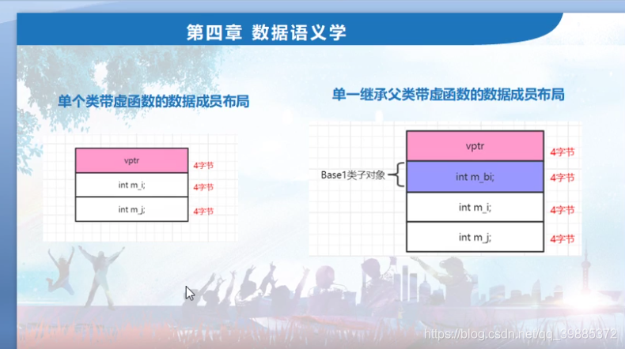
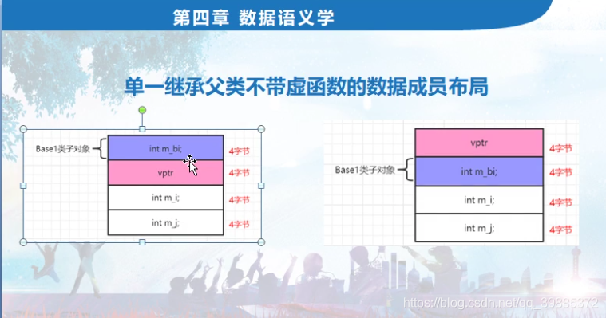

```c++
// project100.cpp : 此文件包含 "main" 函数。程序执行将在此处开始并结束。
//

#include "pch.h"
#include <iostream>
#include <time.h >
#include <stdio.h>
using namespace std;

class Base
{
public:
	int m_bi;
	//virtual void mybvirfunc() {}
};
class MYACLS :public Base
{
public:
	int m_i;
	int m_j;

	virtual void myvirfunc() {} //虚函数
	MYACLS()
	{
		int abc = 1; //方便加断点
	}
	~MYACLS()
	{
		int def = 0;//方便加断点
	}
};

int main()
{		
	//一：单个类带虚函数的数据成员布局
	//类中引入虚函数时，会有额外的成本付出
	//(1)编译的时候，编译器会产生虚函数表，参考三章五节
	//(2)对象中会产生 虚函数表指针vptr，用以指向虚函数表的
	//(3)增加或者扩展构造函数，增加给虚函数表指针vptr赋值的代码，让vptr指向虚函数表；
	//(4)如果多重继承，比如你继承了2个父类，每个父类都有虚函数的话，
	//每个父类都会有vptr，那继承时，子类就会把这两根vptr都继承过来，
	   //如果子类还有自己额外的虚函数的话，子类与第一个基类共用一个vptr（三章四节）；
	//(5)析构函数中也被扩展增加了虚函数表指针vptr相关的赋值代码，
	//感觉这个赋值代码似乎和构造函数中代码相同；

	//二：单一继承父类带虚函数的数据成员布局
	//三：单一继承父类不带虚函数的数据成员布局


	
	cout << sizeof(MYACLS) << endl;
	printf("MYACLS::m_bi = %d\n", &MYACLS::m_bi);
	printf("MYACLS::m_i = %d\n", &MYACLS::m_i);
	printf("MYACLS::m_j = %d\n", &MYACLS::m_j);
	
	MYACLS myobj;
	myobj.m_i = 3;
	myobj.m_j = 6;
	myobj.m_bi = 9;


	
	return 1;
}

```




