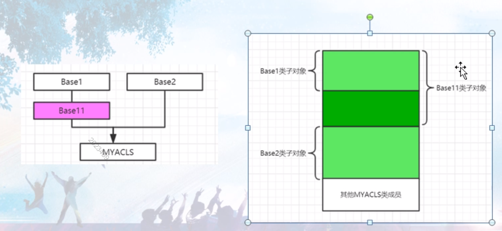

```c++
// project100.cpp : 此文件包含 "main" 函数。程序执行将在此处开始并结束。
//

#include "pch.h"
#include <iostream>
#include <time.h >
#include <stdio.h>
using namespace std;

class Base1
{
public:
	int m_bi;
	virtual void mybvirfunc() {}

	Base1()
	{
		printf("Base1::Base1()的this指针是：%p!\n", this);
	}
};
class Base2
{
public:
	int m_b2i;
	virtual void mybvirfunc2() {}

	Base2()
	{
		printf("Base2::Base2()的this指针是：%p!\n", this);
	}
};
class MYACLS :public Base1,public Base2
{
public:
	int m_i;
	int m_j;

	virtual void myvirfunc() {} //虚函数
	MYACLS()
	{
		int abc = 1; //方便加断点
		printf("MYACLS::MYACLS()的this指针是：%p!\n", this);
	}
	~MYACLS()
	{
		int def = 0;//方便加断点
	}
};
int main()
{
	//一：单一继承数据成员布局this指针偏移知识补充
	//二章三节 ：this指针调整

	//二：多重继承且父类都带虚函数的数据成员布局
	//（1）通过this指针打印，我们看到访问Base1成员不用跳 ，访问Base2成员要this指针要偏移（跳过）8字节；
	//（2）我们看到偏移值，m_bi和m_b2i偏移都是4；
	//（3）this指针，加上偏移值 就的能够访问对应的成员变量，比如m_b2i = this指针+偏移值

	//我们学习得到一个结论：
	//我们要访问一个类对象中的成员，成员的定位是通过：this指针（编译器会自动调整）以及该成员的偏移值，这两个因素来定义；
	   //这种this指针偏移的调整 都需要编译器介入来处理完成；

	cout << sizeof(MYACLS) << endl;
	printf("MYACLS::m_bi = %d\n", &MYACLS::m_bi);
	printf("MYACLS::m_b2i = %d\n", &MYACLS::m_b2i);
	printf("MYACLS::m_i = %d\n", &MYACLS::m_i);
	printf("MYACLS::m_j = %d\n", &MYACLS::m_j);

	MYACLS myobj;
	myobj.m_i = 3;
	myobj.m_j = 6;
	myobj.m_bi = 9;
	myobj.m_b2i = 12;


	MYACLS *pmyobj = new MYACLS();
	pmyobj->m_i = 3;
	pmyobj->m_j = 6;
	pmyobj->m_bi = 9;
	pmyobj->m_b2i = 12;


	//Base2 *pbase2 = &myobj; //this指针调整导致pbase2实际是向前走8个字节的内存位置的
	//                            //myobj = 0x0093fad0，经过本语句以后，pbase2 = 0x0093fad8
	站在编译器视角，把上边这行语句进行了调整
	Base2 *pbase2 = (Base2 *)(((char *)&myobj) + sizeof(Base1));
	//Base1 *pbase1 = &myobj; 

	//Base2 *pbase2 = new MYACLS(); //父类指针new子类对象 ，这里new出来的是24字节，分配了24个字节但给pbase2指向少了最前面8个字节
	//MYACLS *psubobj = (MYACLS *)pbase2; //比上边地址少了8字节（偏移）
	delete pbase2; //报异常。所以我们认为pbase2里边返回的地址不是分配的首地址，而是偏移后地址。
	//          //而真正分配的首地址应该是在psubobj里边的这个地址
	//delete psubobj;


	return 1;
}
```




```c++
#include <stdio.h>
#include <iostream>
#include <string>

class BASE1
{
public:
    int m_bi;
    virtual void myvirfunc(){}
    BASE1()
    {
        std::cout << "BASE::BASE1() 的this指针是 = " << (void *)this << std::endl;
    }
};
class BASE2
{
public:
    int m_b2;
    virtual void myvirfunc2(){}
    BASE2()
    {
        std::cout << "BASE2::BASE2() 的this指针是 = " << (void *)this << std::endl;
    }
};

class MYACLS:public BASE1, public BASE2
{
public:
    int m_i;
    int m_j;
    
    virtual void virtualfunc()
    {
        
    }
    
    MYACLS()
    {
        std::cout << "MYACLS::MYACLS()的this指针是 = " << (void*)this << std::endl;
    }
    ~MYACLS()
    {
        
    }
};

using namespace std;

int main()
{
    // 单个类带虚函数的数据成员布局
    // 当类中引入虚函数时，会有额外的成本付出
    // 1）编译的时候，编译器会产生虚函数表
    // 2）对象中会多出一个成员变量，虚函数表指针vptr，可以用于指向虚函数表
    // 3）编译器会扩展构造函数【往构造函数中增加虚函数表指针赋值的代码，让vptr指向虚函数表（因为多态的原因，父类和子类都需要分别设定vptr的值）】
    // 4）如果是多重继承，比如继承了2个类，每个父类都有虚函数的话，那么每个父类都会有vptr，那继承时，子类会把这两个vptr都继承过来。这就等价于子类有两个vptr
    // 如果子类自己也有虚函数的话，那子类与第一个父类共用一个vptr
    // 5）析构函数中也被扩展增加了虚函数表指针vptr相关的赋值代码，感觉这个赋值代码在析构函数和构造函数中代码相同
    // 6)单一继承不带虚函数的数据成员布局其实和单个类带虚函数的数据成员布局是一样的
    
    MYACLS aa;
    
    std::cout << "MYACLS 的内存大小 = " << sizeof(MYACLS) << std::endl;
    std::cout << "MYACLS::m_bi = " << (size_t)&(((MYACLS*)0)->m_bi) << std::endl;
    std::cout << "MYACLS::m_b2 = " << (size_t)&(((MYACLS*)0)->m_b2) << std::endl;
    std::cout << "MYACLS::m_i = " << (size_t)&(((MYACLS*)0)->m_i) << std::endl;
    std::cout << "MYACLS::m_j = " << (size_t)&(((MYACLS*)0)->m_j) << std::endl;
    
    // MYACLS 的内存大小 = 16  // win下是12 【linux下一虚函数表指针为8字节】
    // MYACLS::m_i = 8          // 4
    // MYACLS::m_j = 12         // 8
    
    // 继承BASE父类后
    // MYACLS 的内存大小 = 24
    // MYACLS::m_bi = 8
    // MYACLS::m_i = 12
    // MYACLS::m_j = 16
    
    // 单一继承this指针调整
    // this指针调整
    // BASE类没有虚函数
    // BASE::BASE() 的this指针是 = 0x7ffdb9a9e938
    // MYACLS::MYACLS()的this指针是 = 0x7ffdb9a9e930
    // 从这个结果来看，如果子类想访问父类的话，this指针得往后调整8个字节
    // BASE类有虚函数
    // BASE::BASE() 的this指针是 = 0x7fffe4eee650
    // MYACLS::MYACLS()的this指针是 = 0x7fffe4eee650
    // 可以看到基类加了虚函数后，this指针相同，不用调整this指针值了
    
    
    // 多重继承且父类都带虚函数的数据成员布局
    
    // BASE::BASE1() 的this指针是 = 0x7ffdfed864c0
    // BASE2::BASE2() 的this指针是 = 0x7ffdfed864d0
    // MYACLS::MYACLS()的this指针是 = 0x7ffdfed864c0
    // MYACLS 的内存大小 = 40
    // MYACLS::m_bi = 8
    // MYACLS::m_b2 = 24
    // MYACLS::m_i = 28
    // MYACLS::m_j = 32
    
    // 可以看到，BASE2的this需要在BASE1的基础上偏移16字节才能访问到BASE2,如果访问BASE1的话
    // 因为BASE1的对象首地址和子类对象首地址是相同的，BASE1的成员是不需要进行this调整的
    
    // 通过this指针的打印，看到访问BASE1的成员不用调整this，访问BASE2的成员this要偏移16字节（win偏移8字节）
    // m_bi 和 m_b2的偏移值偏移值在windows下都是4字节【在linux下为8和24】
    // this指针加上偏移值就能访问对应的成员变量，比如m_b2 = this + 偏移值
    
    // 结论：要访问一个类对象中的成员，成员的定位是通过this指针【编译器会自动调整】+该成员的偏移值这两个因素来定位的
    // 这种this指针偏移的调整都是编译器介入自动完成的
    
    
    std::cout << "子类对象的地址" << (void *)&aa << std::endl;
    BASE2 *pbase2 = &aa;
    std::cout << "基类指针的指向" << (void*)pbase2 << std::endl;
    // 基类指针指向一个子类对象（子类地址赋值给基类指针）
    // 这个从语法上是被允许的【然后打印子类对象的地址和赋给基类指针后，基类指针指向的地址】
    // 子��对象的地址0x7ffdff7ca560
    // 基类指针的指向0x7ffdff7ca570
    // 发现一个现象就是子类独享地址赋值给基类指针后，这个地址被编译器做了调整（偏移了16个字节）
    // 因为pbase2这个基类指针能处理的对象那个是BASE2这个类，所以他的this就被系统自动调整偏移指到BASE2的内存地址上了
    // 在编译器视角下，把上面的赋值语句做了这样的调整
    BASE2 *pbase2_ = (BASE2*)(((char *)&aa) + sizeof(BASE1));
    std::cout << (void*)pbase2_ << std::endl;
    // 0x7fff26798c70
    
    
    // 父类指针new子类对象【这里new的是子类，所以new出来的对象也应该是子类对象的size（40）】
    BASE2 *Pbase2 = new MYACLS();
    std::cout << "Pbase2 = " << (void*)Pbase2 << std::endl;
    // Pbase2 = 0x5650953ff2d0
    // 这里应该这样理解，虽然new子类对象，分配了40个字节，但是this在返回给基类指针的时候，this做了调整
    // 偏移了16个字节，让其真正指向基类对象的首地址
    
    // 然后，因为Pbase2指向的是一个子类MYACLS的对象，那我这把这个指针指向一个真正的MYACLS
    MYACLS *Pmycla = (MYACLS*) Pbase2;
    std::cout << "Pmycla = " << (void *)Pmycla << std::endl;
    // Pmycla = 0x5650953ff2c0
    // 然后把这个指向基类对象内存首地址的指针转为子类对象指针的时候，编译器又把这个this指针调整偏移回16个字节，
    // 指向最开始完整分配的子类对象内存的首地址
    
    // 然后一个有意思的地方是，我们上面不是用父类指针new了一个子类对象嘛，那这个new出来的指针能否delete呢？
    // delete Pbase2;  // 报异常
    // 编译器会爆异常，这也证实了我们上面的话，这里之所以不能delete，就是因为这个指针没有指向系统分配的内存的起始地址
    // 而是指向了一个经过偏移后的地址，所以自然不能成功调用delete
    // 而真正分配的内存的首地址，是在Pmycla里边的地址
    delete Pmycla;
    
    return 0;
}
```

