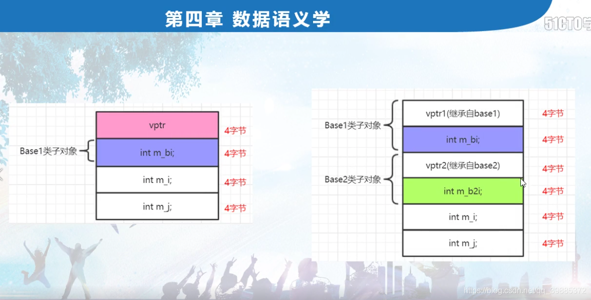
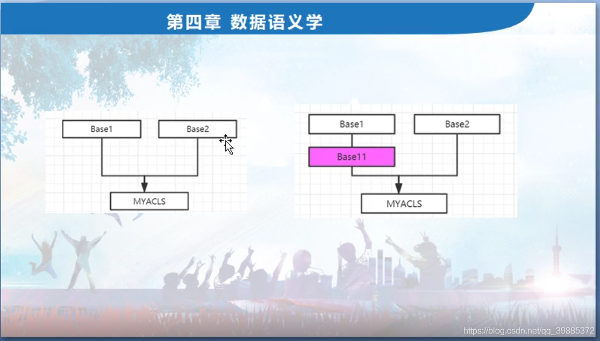
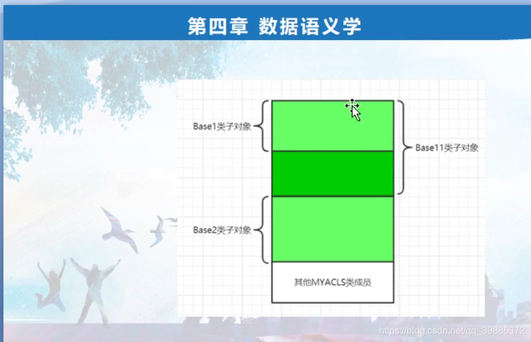

```c++
// project100.cpp : 此文件包含 "main" 函数。程序执行将在此处开始并结束。
//

#include "pch.h"
#include <iostream>
#include <time.h >
#include <stdio.h>
using namespace std;

class Base1
{
public:
	int m_bi;
	virtual void mybvirfunc() {}

	Base1()
	{
		printf("Base1::Base1()的this指针是：%p!\n", this);
	}
};
class Base2
{
public:
	int m_b2i;
	virtual void mybvirfunc2() {}

	Base2()
	{
		printf("Base2::Base2()的this指针是：%p!\n", this);
	}
};
class MYACLS :public Base1,public Base2
{
public:
	int m_i;
	int m_j;

	virtual void myvirfunc() {} //虚函数
	MYACLS()
	{
		int abc = 1; //方便加断点
		printf("MYACLS::MYACLS()的this指针是：%p!\n", this);
	}
	~MYACLS()
	{
		int def = 0;//方便加断点
	}
};
int main()
{
	//一：单一继承数据成员布局this指针偏移知识补充
	//二章三节 ：this指针调整

	//二：多重继承且父类都带虚函数的数据成员布局
	//（1）通过this指针打印，我们看到访问Base1成员不用跳 ，访问Base2成员要this指针要偏移（跳过）8字节；
	//（2）我们看到偏移值，m_bi和m_b2i偏移都是4；
	//（3）this指针，加上偏移值 就的能够访问对应的成员变量，比如m_b2i = this指针+偏移值

	//我们学习得到一个结论：
	//我们要访问一个类对象中的成员，成员的定位是通过：this指针（编译器会自动调整）以及该成员的偏移值，这两个因素来定义；
	   //这种this指针偏移的调整 都需要编译器介入来处理完成；

	cout << sizeof(MYACLS) << endl;
	printf("MYACLS::m_bi = %d\n", &MYACLS::m_bi);
	printf("MYACLS::m_b2i = %d\n", &MYACLS::m_b2i);
	printf("MYACLS::m_i = %d\n", &MYACLS::m_i);
	printf("MYACLS::m_j = %d\n", &MYACLS::m_j);

	MYACLS myobj;
	myobj.m_i = 3;
	myobj.m_j = 6;
	myobj.m_bi = 9;
	myobj.m_b2i = 12;


	MYACLS *pmyobj = new MYACLS();
	pmyobj->m_i = 3;
	pmyobj->m_j = 6;
	pmyobj->m_bi = 9;
	pmyobj->m_b2i = 12;


	//Base2 *pbase2 = &myobj; //this指针调整导致pbase2实际是向前走8个字节的内存位置的
	//                            //myobj = 0x0093fad0，经过本语句以后，pbase2 = 0x0093fad8
	站在编译器视角，把上边这行语句进行了调整
	Base2 *pbase2 = (Base2 *)(((char *)&myobj) + sizeof(Base1));
	//Base1 *pbase1 = &myobj; 

	//Base2 *pbase2 = new MYACLS(); //父类指针new子类对象 ，这里new出来的是24字节，分配了24个字节但给pbase2指向少了最前面8个字节
	//MYACLS *psubobj = (MYACLS *)pbase2; //比上边地址少了8字节（偏移）
	delete pbase2; //报异常。所以我们认为pbase2里边返回的地址不是分配的首地址，而是偏移后地址。
	//          //而真正分配的首地址应该是在psubobj里边的这个地址
	//delete psubobj;


	return 1;
}
```





