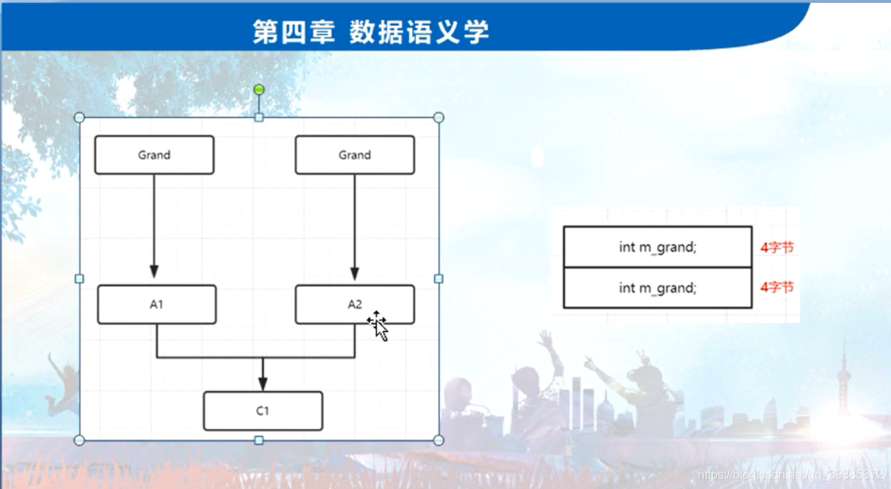
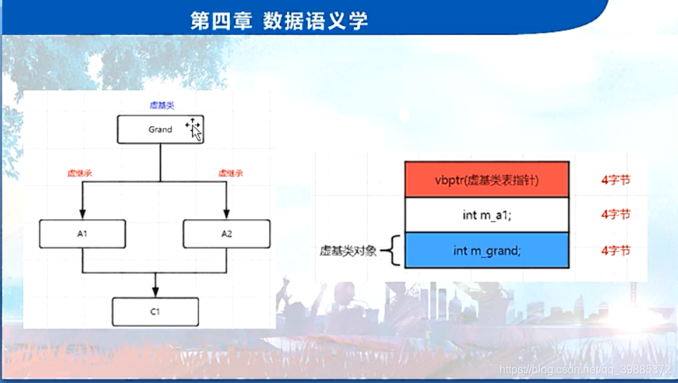
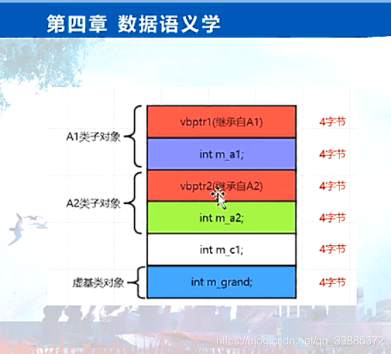

```c++
// project100.cpp : 此文件包含 "main" 函数。程序执行将在此处开始并结束。
//

#include "pch.h"
#include <iostream>
#include <time.h >
#include <stdio.h>
#include <vector>

using namespace std;

class Grand //爷爷类
{
public:
	int m_grand;
};
class A1 : virtual public Grand
{
public:
	int m_a1;
};

class A2 : virtual public Grand
{
public:
	int m_a2;
};

class C1 :public A1, public A2
{
public:
	int m_c1;
};

int main()
{
	//一：虚基类（虚继承/虚派生）问题的提出
	//传统多重继承造成的 ：空间问题，效率问题，二义性问题；
	cout << sizeof(Grand) << endl;
	cout << sizeof(A1) << endl;
	cout << sizeof(A2) << endl;
	cout << sizeof(C1) << endl;

	//C1 c1;
	//c1.m_grand = 12; //访问不明确，名字冲突，二义性；
	//                         //引入虚基类之后，就不会出现访问不明确的问题了
	//c1.A1::m_grand = 13;
	//c1.A2::m_grand = 15;

	//虚基类，让Grand类只被继承一次；

	//二：虚基类初探
	//两个概念：(1)虚基类表 vbtable(virtual base table).(2)虚基类表指针 vbptr(virtual base table pointer)
	//空类sizeof(Grand) ==1好理解； 
	//virtual虚继承之后，A1,A2里就会被编译器插入一个虚基类表指针，这个指针，有点成员变量的感觉
	//A1,A2里因为有了虚基类表指针，因此占用了4个字节
	A1 a1;
	A2 a2;
	//虚基类表指针，用来指向虚基类表（后续谈）。

	   	  	

	return 1;
}
```







- 虚基类的作用
- 当一个派生类中有多个直接基类，而这些直接基类又有一个共同的基类，则在最终的派生类中会保留该间接基类的数据成员的多份同名成员，就会造成二义性，将这个共同基类设置为虚基类时，同名的数据成员就会只存在一个副本，同一个函数名只有一个映射，就解决了二义性。
- 也就是说，当声明为虚基类时，在程序中只保留了一个共同基类的数据副本，对象 B 和对象 C 的 varA 都指向同一个 varA（本来也应该是这样），这样再调用 varA 时，在程序中只有一个 varA，编译器就不会产生疑问了。

> 虚函数，是在类中中的概念，他的重要作用就是实现面向对象的多态的特性，
> 抽象类，是类的概念，他必须和纯虚函数函数搭配使用
> 虚基类，是继承中的概念，是继承过程中用来解决多个间接基类同一个副本产生的二义性的方法。

```c++
#include <stdio.h>
#include <iostream>
#include <string>

using namespace std;

class Grand // 爷爷类
{
public:
    int m_grand;
    
};

// class Parent1 : public Grand   // 父类1
class Parent1 : virtual public Grand   // 父类1     虚继承
{
public:
    int m_a1;
};

// class Parent2 : public Grand    // 父类2
class Parent2 : virtual public Grand    // 父类2
{
public:
    int m_a2;
};

class Sun : public Parent1, public Parent2  // 子类
{
public:
    int m_c1;
};


int main()
{
    // 虚基类（虚继承/虚派生）
    // 传统多继承造成的：空间问题，效率问题，二义性问题
    
    std::cout << "爷爷类的size【Grand】 = " << sizeof(Grand) << std::endl;
    std::cout << "父类1的size【Parent1】 = " << sizeof(Parent1) << std::endl;
    std::cout << "父类2的size【Parent2】 = " << sizeof(Parent2) << std::endl;
    std::cout << "子类的size【Sun】 = " << sizeof(Sun) << std::endl;
    
    // 爷爷类的size【Grand】 = 4
    // 父类1的size【Parent1】 = 4
    // 父类2的size【Parent2】 = 4
    // 子类的size【Sun】 = 8        
    // 这里8字节就表示，子类即继承了父类1继承的爷爷类的成员m_grand【4字节】
    // 又同时继承了父类2继承的爷爷类的成员m_grand【4字节】
    // 也就是爷爷类的成员m_grand被继承了两份
    
    Sun s1;
    // s1.m_grand = 12;    // request for member ‘m_grand’ is ambiguous
    // 报错对成员m_grand的访问不明确
    // 访问不明确【名字冲突，二义性】
    // 为了避免这种不明确，我们可以明确告知编译器，走哪个路线访问
    // s1.Parent1::m_grand = 12;
    // s1.Parent2::m_grand = 120;
    
    // std::cout << s1.Parent1::m_grand << std::endl;  // 12
    // std::cout << s1.Parent2::m_grand << std::endl;  // 120
    // std::cout << "s1.Parent1::m_grand的地址是 = " << (void*)&(s1.Parent1::m_grand) << std::endl;
    // std::cout << "s1.Parent2::m_grand的地址是 = " << (void*)&(s1.Parent2::m_grand) << std::endl;
    // s1.Parent1::m_grand的�址是 = 0x7ffc3ee5a4c0
    // s1.Parent2::m_grand的地址是 = 0x7ffc3ee5a4c4
    // 这样就证实了，在子类对象S1中有两个m_grand的拷贝
    
    
    // 虚基类：让Grand类只被继承一次
    // 引入虚基类后，就不会出现访问不明确的问题
    
    // 虚基类为一个空类的情况下的继承后的各个类的size情况
    // 爷爷类的size【Grand】 = 1    // 空类sizeof = 1
    // 父类1的size【Parent1】 = 8   // win下为4
    // 父类2的size【Parent2】 = 8   // win下为4
    // 子类的size【Sun】 = 16       // win下为8
    
    // 虚基类两个概念
    // 1）虚基类表 vbtable【virtual base table】
    // 2）虚基类表指针 vbptr【virtual base table pointer】
    
    // 虚继承后，Parent1和Parent2里就会被插入一个虚基类表指针，这个指针，有点成员变量的感觉
    // Parent1和Parent2因为有了虚基类表指针，所以内存占用为8字节【win下为4字节】
    // 虚基类表指针用来指向虚基类表（这个虚基类表在编译阶段就已经被编译出来了）
    // 然后Sun子类因为继承了Parent1和Parent2，就把他们两个的虚基类表指针都给继承过来了，所以内存大小就为16字节【win下为8字节】
    
    // 加了成员变量后，各个类的size情况
    // 爷爷类的size【Grand】 = 4
    // 父类1的size【Parent1】 = 16  【win 12】
    // 父类2的size【Parent2】 = 16  【win 12】
    // 子类的size【Sun】 = 40   【win 24】
    return 0;
}
```

