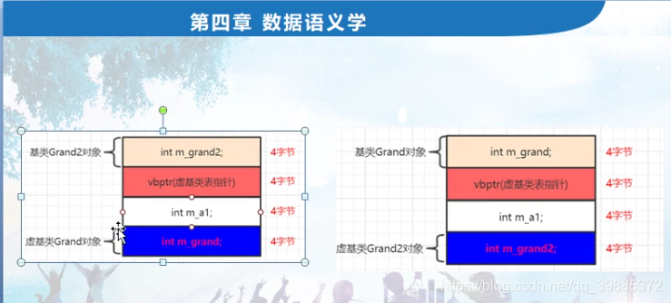

```c++
// project100.cpp : 此文件包含 "main" 函数。程序执行将在此处开始并结束。
//

#include "pch.h"
#include <iostream>
#include <time.h >
#include <stdio.h>
#include <vector>

using namespace std;

class Grand //爷爷类
{
public:
	int m_grand;
};

class Grand2 //爷爷类
{
public:
	int m_grand2;
	//int m_grand2_1;
};

class A1 : virtual public Grand,virtual public Grand2
{
public:
	int m_a1;
};

class A2 : virtual public Grand//, virtual public Grand2
{
public:
	int m_a2;
};

class C1 :public A1, public A2
{
public:
	int m_c1;
};

int main()
{	
	//一：虚基类表内容之5-8字节内容分析
	//虚基类表 一般是8字节，四个字节为一个单位。每多一个虚基类，虚基类表会多加4个字节
	//编译器因为有虚基类，会给A1,A2类增加默认的构造函数，并且这个默认构造函数里，会被编译器增加进去代码，
	   //给vbptr虚基类表指针赋值。

	


	cout << sizeof(Grand) << endl;
	cout << sizeof(A1) << endl;
	cout << sizeof(A2) << endl;
	cout << sizeof(C1) << endl;

	A1 a1obj;
	a1obj.m_grand = 2;
	a1obj.m_grand2 = 6;
	//a1obj.m_grand2_1 = 7;
	a1obj.m_a1 = 5;

	//“虚基类表指针”成员变量的首地址 + 这个偏移量 就等于 虚基类对象首地址。跳过这个偏移值，我们就能够访问到虚基类对象；

	//二：继续观察各种形色的继承
	//a)虚基类表 现在是3项， +4，+8,都是通过取得虚基类表中的偏移值来赋值的
	//b)虚基类表中的偏移量是按照继承顺序来存放的；
	//c)虚基类子对象一直放在最下边；

	//三：虚基类表内容之1-4字节内容分析
	//虚基类表指针成员变量的首地址 ，和本对象A1首地址之间的偏移量 也就是：虚基类表指针 的首地址 - A1对象的首地址

	//结论：只有对虚基类成员进行处理比如赋值的时候，才会用到虚基类表，取其中的偏移，参与地址的计算；
	   	  	

	return 1;
}

```


