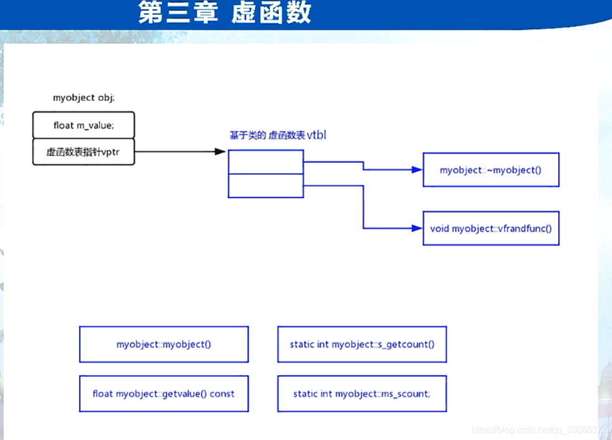

```c++
// project100.cpp : 此文件包含 "main" 函数。程序执行将在此处开始并结束。
//

#include "pch.h"
#include <iostream>
using namespace std;

class A
{
public:
	int i; //4字节
	virtual void testfunc() {}  //虚函数，vptr4字节。
};

int main()
{
	//虚函数表指针位置分析
	//类：有虚函数，这个类会产生一个虚函数表。
	//类对象，有一个指针，指针(vptr)会指向这个虚函数表的开始地址。
	A aobj;
	int ilen = sizeof(aobj);
	cout << ilen << endl;  //8字节

	char *p1 = reinterpret_cast<char *>(&aobj); //类型转换，硬转 &aobj这是对象aobj的首地址。
	char *p2 = reinterpret_cast<char *>(&(aobj.i));
	if (p1 == p2) //说明aobj.i和aobj的位置相同，说明i在对象aobj内存布局的上边。虚函数表指针vptr在下边
	{
		cout << "虚函数表指针位于对象内存的末尾" << endl;
	}
	else
	{
		cout << "虚函数表指针位于对象内存的开头" << endl;
	}
	      


	return 1; 
}

```
