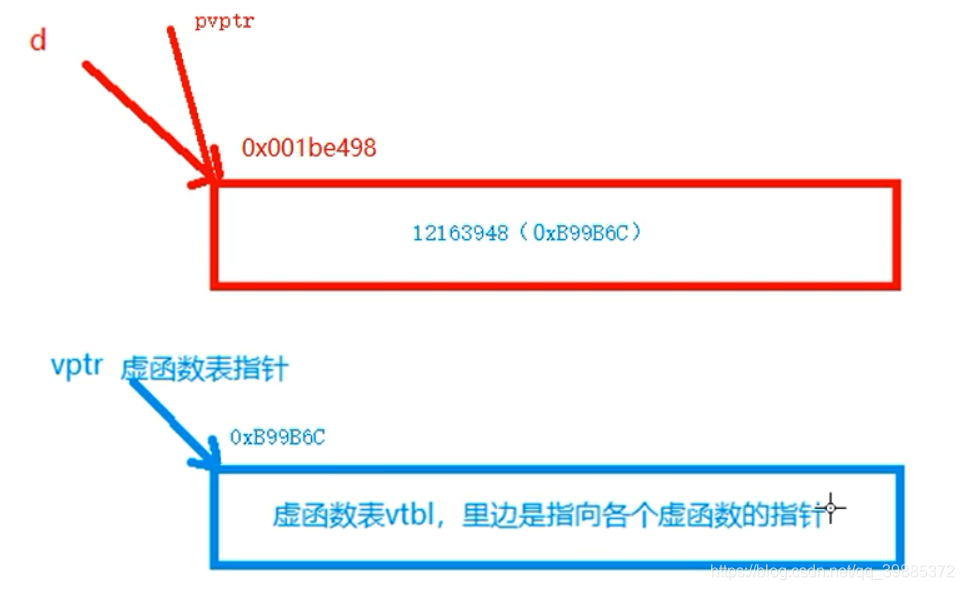
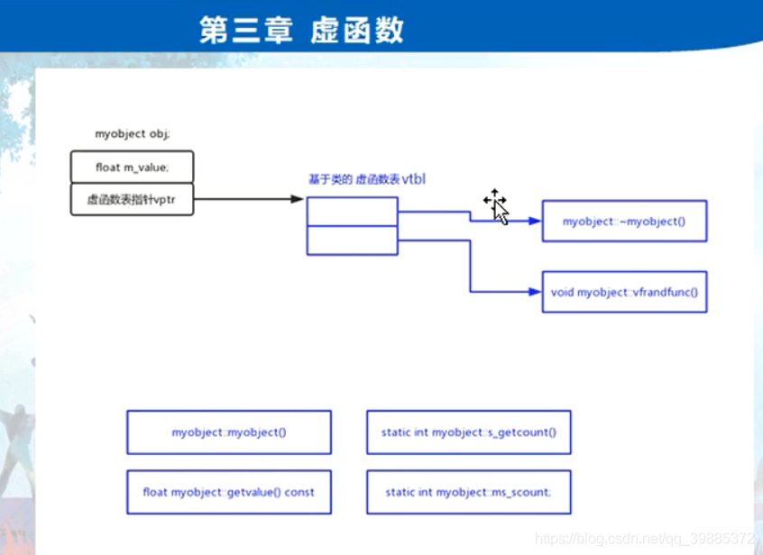

```c++
// project100.cpp : 此文件包含 "main" 函数。程序执行将在此处开始并结束。
//

#include "pch.h"
#include <iostream>
using namespace std;

//父类
class Base
{
public:
	virtual void f() { cout << "Base::f()" << endl; }
	virtual void g() { cout << "Base::g()" << endl; }
	virtual void h() { cout << "Base::h()" << endl; }
};
class Derive :public Base 
{
	virtual void g() { cout << "Derive::g()" << endl; }
};

int main()
{
	//继承关系作用下虚函数的手工调用			
	cout << sizeof(Base) << endl;	
	cout << sizeof(Derive) << endl;

	Derive *d = new Derive(); //派生类指针。
	long *pvptr = (long *)d;  //指向对象的指针d转成了long *类型。
	//(*pvptr) 表示pvptr指向的对象，也就是Derive本身。Derive对象是4字节的，代表的是虚函数表指针地址。
	long *vptr = (long *)(*pvptr); 

	for (int i = 0; i <= 4; i++) //循环5次；
	{
		printf("vptr[%d] = 0x:%p\n", i, vptr[i]);
	}

	typedef void(*Func)(void); //定义一个函数指针类型
	Func f = (Func)vptr[0]; //f就是函数指针变量。 vptr[0]是指向第一个虚函数的。
	Func g = (Func)vptr[1];
	Func h = (Func)vptr[2];
	/*Func i = (Func)vptr[3];
	Func j = (Func)vptr[4];*/

	f();
	g();
	h();
	//i();

	Base *dpar = new Base();
	long *pvptrpar = (long *)dpar;
	long *vptrpar = (long *)(*pvptrpar);

	for (int i = 0; i <= 4; i++) //循环5次；
	{
		printf("vptr Base[%d] = 0x:%p\n", i, vptrpar[i]);
	}

	Func fpar = (Func)vptrpar[0]; 
	Func gpar = (Func)vptrpar[1];
	Func hpar = (Func)vptrpar[2];

	cout << "--------------------" << endl;
	fpar(); 
	gpar();
	hpar();

	return 1; 
}
```






```c++
#include <stdio.h>
#include <iostream>

// 父类
class Base
{
    // 该类对象的大小应该是4字节（Windows下, linux下的话应该是8字节，因为没有其他成员，只有一个虚函数表指针）
public:
    virtual void f()
    {
        std::cout << "Base::f()" << std::endl;
    }
    virtual void g()
    {
        std::cout << "Base::g()" << std::endl;
    }
    virtual void h()
    {
        std::cout << "Base::h()" << std::endl;
    }
};

// 子类
class Derive:public Base
{
public:
    virtual void g()
    {
        std::cout << "Derive::g()" << std::endl;
    }
};

int main()
{
    // 继承关系作用下虚函数的手工调用
    std::cout << sizeof(Base) << std::endl;
    std::cout << sizeof(Derive) << std::endl;
    
    Derive *d = new Derive();   // 派生类指针
    long *pvtr = (long *)d;     // 指向对象的指针d 转成 long *类型
    long *vptr = (long *)(*pvtr); 
    // 首先 pvtr 是一个指针，
    // 那么 (*pvtr) 表示 pvtr指向的对象，也就是Derive对象本身
    // Derive对象【win 4字节， linux 8字节，代表的是虚函数表指针】
    
    for (int i = 0; i <= 4; i++)
    {
        printf("vptr[%d] = 0x:%p\n ", i, vptr[i]);
    }
    // vptr[0] = 0x:0x55a1294482ec
    // vptr[1] = 0x:0x55a129448394
    // vptr[2] = 0x:0x55a12944835c
    // vptr[3] = 0x:(nil)
    // vptr[4] = 0x:0x55a12944ad68
    
    // 前面3个是对应的虚函数首地址，后面的不是，那既然得到了虚函数地址，那么是否可以直接用地址去调用函数功能
    
    typedef void(*funcP)(void);     // 定义一个函数指针类型
    funcP f = (funcP)vptr[0];   // f 就是函数指针变量 vptr[0] 指向虚函数首地址
    funcP g = (funcP)vptr[1];
    funcP h = (funcP)vptr[2];
    
    f();    // Base::f()
    g();    // Derive::g()
    h();    // Base::h()
    
    // 从调用结果看，子类虚函数是会覆盖父类虚函数
    
    Base *dpar = new Base();
    long *pvptrapr = (long *)dpar;
    long *vptrPra = (long *)(* pvptrapr);
    
    funcP bf = (funcP)vptrPra[0];
    funcP bg = (funcP)vptrPra[1];
    funcP bh = (funcP)vptrPra[2];
    
    bf();   // Base::f()
    bg();   // Base::g()
    bh();   // Base::h()
    
    return 0;
}

```

