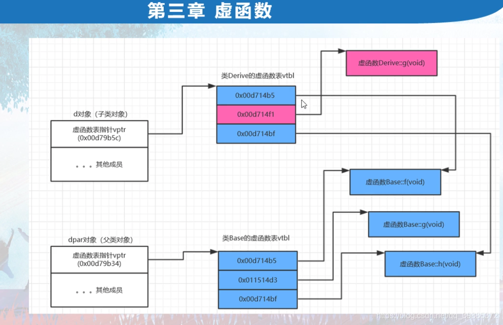

【虚函数表指针跟着对象走，虚函数表跟着类走】

（1）一个类只有包含虚函数才会存在虚函数表，同属于一个类的对象共享虚函数表，但是有各自的vptr（虚函数表指针），当然所指向的地址（虚函数表首地址）相同。
（2）父类中有虚函数就等于子类中有虚函数。话句话来说，父类中有虚函数表，则子类中肯定有虚函数表。因为你是继承父类的。
也有人认为，如果子类中把父类的虚函数的virtual去掉，是不是这些函数就不再是虚函数了？
答案肯定不是，因为只要在父类中是虚函数，那么子类中即便不写virtual，也依旧是虚函数。
但不管是父类还是子类，都只会有一个虚函数表，不能认为子类中有一个虚函数表+父类中有一个虚函数表，就得到一个结论：子类中有两个虚函数表，这个结论是错误的

子类中是否可能会有多个虚函数表呢？后续我们讲解这个事；

（3）如果子类中完全没有新的虚函数，则我们可以认为子类的虚函数表和父类的虚函数表内容相同。
但，仅仅是内容相同，这两个虚函数表在内存中处于不同位置，换句话来说，这是内容相同的两张表。
虚函数表中每一项，保存着一个虚函数的首地址，但如果子类的虚函数表某项和父类的虚函数表某项代表同一个函数
这表示子类没有覆盖父类的虚函数），
则该表项所执行的该函数的地址应该相同。
（4）超出虚函数表部分内容不可知；


OO(面向对象)  和OB(基于对象）概念：
**c++通过类的指针和引用来支持多态**，这是一种程序设计风格，这就是我们常说的面向对象。object-oriented model;
OB(object-based)，也叫ADT抽象数据模型【abstract datatype model】，不支持多态（也就是没有虚函数），执行速度更快。因为 函数调用的解析不需要运行时决定（没有多态）,而是在编译期间就解析完成，内存空间紧凑程度上更紧凑，
因为没有虚函数指针和虚函数表这些概念了；

多态产生情况：一般是父类指针指向子类对象，或者父类的引用给的是子类对象。

Base *pbase = new Derive();	// 父类指针指向子类对象
Base &base2 = derive2;	// 父类的引用给的是子类对象
但显然，OB的设计灵活性就差；
c++既支持面向对象程序设计(继承，多态)(OO)，也支持基于对象(OB)程序设计。

```c++
// project100.cpp : 此文件包含 "main" 函数。程序执行将在此处开始并结束。
//

#include "pch.h"
#include <iostream>
using namespace std;

//父类
class Base
{
public:
	virtual void f() { cout << "Base::f()" << endl; }
	virtual void g() { cout << "Base::g()" << endl; }
	virtual void h() { cout << "Base::h()" << endl; }
};
class Derive :public Base 
{
	virtual void g() { cout << "Derive::g()" << endl; }
	/* void f() { cout << "Derive::f()" << endl; }
	 void g() { cout << "Derive::g()" << endl; }
	 void h() { cout << "Derive::h()" << endl; }*/

};

int main()
{
	继承关系作用下虚函数的手工调用			
	//cout << sizeof(Base) << endl;	
	//cout << sizeof(Derive) << endl;

	//Derive *d = new Derive(); //派生类指针。
	//Derive *d2 = new Derive(); //派生类指针。

	//long *pvptr = (long *)d;  //指向对象的指针d转成了long *类型。
	//long *vptr = (long *)(*pvptr); //(*pvptr) 表示pvptr指向的对象，也就是Derive本身。
	//Derive对象是4字节的，代表的是虚函数表指针地址。

	//long *pvptr2 = (long *)d2;
	//long *vptr2 = (long *)(*pvptr2);


	//for (int i = 0; i <= 4; i++) //循环5次；
	//{
	//	printf("vptr[%d] = 0x:%p\n", i, vptr[i]);
	//}

	//typedef void(*Func)(void); //定义一个函数指针类型
	//Func f = (Func)vptr[0]; //f就是函数指针变量。 vptr[0]是指向第一个虚函数的。
	//Func g = (Func)vptr[1];
	//Func h = (Func)vptr[2];
	///*Func i = (Func)vptr[3];
	//Func j = (Func)vptr[4];*/

	//f();
	//g();
	//h();
	i();

	//Base *dpar = new Base();
	//long *pvptrpar = (long *)dpar;
	//long *vptrpar = (long *)(*pvptrpar);

	//for (int i = 0; i <= 4; i++) //循环5次；
	//{
	//	printf("vptr Base[%d] = 0x:%p\n", i, vptrpar[i]);
	//}

	//Func fpar = (Func)vptrpar[0]; 
	//Func gpar = (Func)vptrpar[1];
	//Func hpar = (Func)vptrpar[2];

	//cout << "--------------------" << endl;
	//fpar(); 
	//gpar();
	//hpar();

	//（1）一个类只有包含虚函数才会存在虚函数表，同属于一个类的对象共享虚函数表，但是有各自的vptr（虚函数表指针），
	//当然所指向的地址（虚函数表首地址）相同。
	//（2）父类中有虚函数就等于子类中有虚函数。话句话来说，父类中有虚函数表，则子类中肯定有虚函数表。因为你是继承父类的。
	//也有人认为，如果子类中把父类的虚函数的virtual去掉，是不是这些函数就不再是虚函数了？
	//只要在父类中是虚函数，那么子类中即便不写virtual，也依旧是虚函数。
	//但不管是父类还是子类，都只会有一个虚函数表，不能认为子类中有一个虚函数表+父类中有一个虚函数表，
	     //得到一个结论：子类中有两个虚函数表。
	//子类中是否可能会有多个虚函数表呢？后续我们讲解这个事；

	//（3）如果子类中完全没有新的虚函数，则我们可以认为子类的虚函数表和父类的虚函数表内容相同。
	 //但，仅仅是内容相同，这两个虚函数表在内存中处于不同位置，换句话来说，这是内容相同的两张表。
	//虚函数表中每一项，保存着一个虚函数的首地址，但如果子类的虚函数表某项和父类的虚函数表某项代表同一个函数
	//（这表示子类没有覆盖父类的虚函数），
	    //则该表项所执行的该函数的地址应该相同。
	//（4）超出虚函数表部分内容不可知；

	typedef void(*Func)(void); //定义一个函数指针类型

	Derive derive;
	long *pvptrderive = (long *)(&derive);  
	//0x00b09b6c {project100.exe!void(* Derive::`vftable'[4])()} {11538847}
	long *vptrderive = (long *)(*pvptrderive); 
	Func f1 = (Func)vptrderive[0]; //0x00b0119f {project100.exe!Base::f(void)}
	Func f2 = (Func)vptrderive[1]; //0x00b0150f {project100.exe!Derive::g(void)}
	Func f3 = (Func)vptrderive[2]; //0x00b01325 {project100.exe!Base::h(void)}
	Func f4 = (Func)vptrderive[3]; //0x69726544
	Func f5 = (Func)vptrderive[4]; //0x3a3a6576

	Derive derive2 = derive; //调用拷贝构造函数
	long *pvptrderive2 = (long *)(&derive2);
	long *vptrderive2 = (long *)(*pvptrderive2);

	Base base = derive; //直接用子类对象给父类对象值，子类中的属于父类那部分内容会被编译器自动区分
	//（切割）出来并拷贝给了父类对象。
	                    //所以Base base = derive;实际干了两个事情：
	                            //第一个事情：生成一个base对象
	                            //第二个事情：用derive来初始化base对象的值。
	                              //这里编译器给咱们做了一个选择，显然derive初始化base对象的时候，
	                                //derive的虚函数表指针值并没有覆盖base对象的虚函数表指针值，
	                                //编译器帮我们做到了这点；
	long *pvptrbase = (long *)(&base);
	//0x00b09b34 {project100.exe!void(* Base::`vftable'[4])()} {11538847}
	long *vptrbase = (long *)(*pvptrbase); 
	Func fb1 = (Func)vptrbase[0];   //0x00b0119f {project100.exe!Base::f(void)}
	Func fb2 = (Func)vptrbase[1];   //0x00b01177 {project100.exe!Base::g(void)}
	Func fb3 = (Func)vptrbase[2];   //0x00b01325 {project100.exe!Base::h(void)}
	Func fb4 = (Func)vptrbase[3];    //0x00000000
	Func fb5 = (Func)vptrbase[4];    //0x65736142

	   	 	   	  
	//OO(面向对象)  和OB(基于对象）概念：
	//c++通过类的指针和引用来支持多态，这是一种程序设计风格，这就是我们常说的面向对象。object-oriented model;
	//OB(object-based)，也叫ADT抽象数据模型【abstract datatype model】，不支持多态,执行速度更快，因为
		   //因为 函数调用的解析不需要运行时决定（没有多态）,而是在编译期间就解析完成，内存空间紧凑程度上更紧凑，
		   //因为没有虚函数指针和虚函数表这些概念了；
	//Base *pbase = new Derive();
	//Base &base2 = derive2;
	//但显然，OB的设计灵活性就差；
	//c++既支持面向对象程序设计(继承，多态)(OO)，也支持基于对象(OB)程序设计。


	   	 

	return 1; 
}
```

