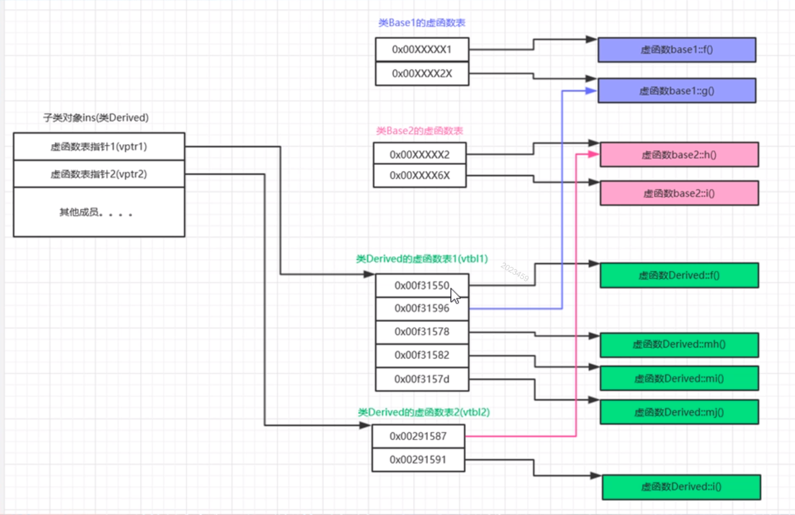

```c++
// project100.cpp : 此文件包含 "main" 函数。程序执行将在此处开始并结束。
//

#include "pch.h"
#include <iostream>
using namespace std;

//基类1
class Base1
{
public:
	virtual void f()
	{
		cout << "base1::f()" << endl;
	}
	virtual void g()
	{
		cout << "base1::g()" << endl;
	}
};

//基类2
class Base2
{
public:
	virtual void h()
	{
		cout << "base2::h()" << endl;
	}
	virtual void i()
	{
		cout << "base2::i()" << endl;
	}
};

//子类
class Derived :public Base1, public Base2
{
public:
	virtual void f() //覆盖父类1的虚函数
	{
		cout << "derived::f()" << endl;
	}
	virtual void i() //覆盖父类2的虚函数
	{
		cout << "derived::i()" << endl;
	}

	//如下三个我们自己的虚函数
	virtual void mh() 
	{
		cout << "derived::mh()" << endl;
	}
	
	virtual void mi()
	{
		cout << "derived::mi()" << endl;
	}

	virtual void mj()
	{
		cout << "derived::mj()" << endl;
	}
};


int main()
{
	//第四节  多重继承虚函数表分析
	//多重继承
	cout << sizeof(Base1) << endl;
	cout << sizeof(Base2) << endl;
	cout << sizeof(Derived) << endl;

	Derived ins; 
	Base1 &b1 = ins; //多态
	Base2 &b2 = ins;
	Derived &d = ins;

	typedef void(*Func)(void);
	long *pderived1 = (long *)(&ins);
	long *vptr1 = (long *)(*pderived1); //取第一个虚函数表指针。

	long *pderived2 = pderived1 + 1; //跳过4字。
	long *vptr2 = (long *)(*pderived2); //取第二个虚函数表指针。

	Func f1 = (Func)vptr1[0]; //0x00ab15d7 {project100.exe!Derived::f(void)}
	Func f2 = (Func)vptr1[1]; //0x00ab15f0 {project100.exe!Base1::g(void)}
	Func f3 = (Func)vptr1[2]; //0x00ab15cd {project100.exe!Derived::mh(void)}
	Func f4 = (Func)vptr1[3]; //0x00ab15ff {project100.exe!Derived::mi(void)}
	Func f5 = (Func)vptr1[4]; //0x00ab15eb {project100.exe!Derived::mj(void)}
	Func f6 = (Func)vptr1[5]; //非正常
	Func f7 = (Func)vptr1[6];
	Func f8 = (Func)vptr1[7];
	
	Func f11 = (Func)vptr2[0]; //0x00ab15af {project100.exe!Base2::h(void)}
	Func f22 = (Func)vptr2[1]; //0x00ab15b9 {project100.exe!Derived::i(void)}
	Func f33 = (Func)vptr2[2]; //非正常
	Func f44 = (Func)vptr2[3];

	b1.f();
	b2.i();
	d.f();
	d.i();
	d.mh();
	d.g();

	//----------------
	cout << "-----------------" << endl;
	f1();
	f2();
	f3();
	f4();
	f5();
	cout << "-------------" << endl;
	f11();
	f22();

	//说明
	//(1)一个对象，如果它的类有多个基类则有多个虚函数表指针（注意是两个虚函数表指针，而不是两个虚函数表）；
	//在多继承中，对应各个基类的vptr按继承顺序依次放置在类的内存空间中，且子类与第一个基类共用一个vptr
	(第二个基类有自己的vptr);

	//(2)老师画图：适合vs2017。
	//（2.1）子类对象ins有里那个虚函数表指针，vptr1,vptr2
	//（2.2）类Derived有两个虚函数表，因为它继承自两个基类；
	//（2.3）子类和第一个基类公用一个vptr（因为vptr指向一个虚函数表，所以也可以说子类和第一个基类
	//共用一个虚函数表vtbl),
		//因为我们注意到了类Derived的虚函数表1里边的5个函数，而g()正好是base1里边的函数。
	//（2.4）子类中的虚函数覆盖了父类中的同名虚函数。比如derived::f(),derived::i();

	   
	

	return 1; 
}
```

1）一个对象，如果他的类有多个基类，则该对象有多个虚函数表指针，【注意比如这里，是两个虚函数表指针，而不是两个虚函数表】
2）在多继承中，对应各个基类的vptr按继承顺序依次放在类的内存空间中，且子类与第一个基类共用一个vptr【第二个基类有自己的vptr】
3）针对本测试代码的虚函数表图



4）子类和第一个基类公用一个vptr（因为vptr指向一个虚函数表，所以也可以说是子类和第一个基类共用一个虚函数vptr），因为我们注意到类Derived的虚函数表1里面的5个函数（linux下6个），而g()正好是Base1里面的函数

5）子类中的虚函数覆盖了父类中的同名虚函数，比如Derived::f()和Derived::i()


linux下的多重继承虚函数表情况

```c++
#include <stdio.h>
#include <iostream>

// 基类1
class Base1
{
public:
    virtual void f()
    {
        std::cout << "Base1::f()" << std::endl;
    }
    
    virtual void g()
    {
        std::cout << "Base1::g()" << std::endl;
    }
};

// 基类2
class Base2
{
public:
    virtual void h()
    {
        std::cout << "Base2::h()" << std::endl;
    }
    
    virtual void i()
    {
        std::cout << "Base2::i()" << std::endl;
    }
};

// 子类
class Derived: public Base1, public Base2
{
public:
    virtual void f()    // 覆盖父类1的虚函数
    {
        std::cout << "Derived::f()" << std::endl;
    }
    virtual void i()    // 覆盖父类2的虚函数
    {
        std::cout << "Derived::i()" << std::endl;
    }
    
    // 添加3个子类自己的虚函数
    virtual void mh()
    {
        std::cout << "Derived::mh()" << std::endl;
    }
    virtual void mi()
    {
        std::cout << "Derived::mi()" << std::endl;
    }
    virtual void mj()
    {
        std::cout << "Derived::mj()" << std::endl;
    }
};

int main()
{
    // 多重继承虚函数表分析
    std::cout << sizeof(Base1) << std::endl;        // 8
    std::cout << sizeof(Base2) << std::endl;        // 8
    std::cout << sizeof(Derived) << std::endl;      // 16
    
    Derived ins;
    Base1 &b1 = ins;        // 多态
    Base2 &b2 = ins;        // 多态
    
    Derived &d = ins;
    
    typedef void(* Func)(void);
    
    long *pderived = (long *)(&ins);
    long *vptr1 = (long *)(* pderived); // 取第一个虚函数表指针
    
    long *pderived2 = pderived + 1;     // 跳过8字节
    long *vptr2 = (long *)(* pderived2); // 取第二个虚函数表指针
    
    Func f1 = (Func)vptr1[0];
    Func f2 = (Func)vptr1[1];
    Func f3 = (Func)vptr1[2];
    Func f4 = (Func)vptr1[3];
    Func f5 = (Func)vptr1[4];
    Func f6 = (Func)vptr1[5];
    Func f7 = (Func)vptr1[6];
    
    Func g1 = (Func)vptr2[0];
    Func g2 = (Func)vptr2[1];
    Func g3 = (Func)vptr2[2];
    Func g4 = (Func)vptr2[3];
    Func g5 = (Func)vptr2[4];
    Func g6 = (Func)vptr2[5];

    b1.f(); // Derived::f()     b1虽然是Base1，但是因为是多态，实际上他这里是子类对象，所以这里是子类对象调用子类的f()，因为子类对象时覆盖父类的，所以这里是Derived::f()
    b2.i(); // Derived::i()
    d.f();  // Derived::f()
    d.i();  // Derived::i()
    d.mh(); // Derived::mh()
    
    std::cout << "=========================" << std::endl;
    std::cout << "虚函数表项1" << std::endl;
    f1();   // Derived::f()
    f2();   // Base1::g()
    f3();   // "Derived::i()
    f4();   // Derived::mh()
    f5();   // Derived::mi()
    f6();   // Derived::mj()	// 注意这里和Windows平台下不一样，win下这个虚函数数是放在表2中，而linux下表1和表2都有
    
    std::cout << "////////////////////////////" << std::endl;
    std::cout << "虚函数表项2" << std::endl;
    g1();   // Base2::h()
    g2();   // Derived::i()
    
    // 说明
    // 1）一个对象，如果他的类有多个基类，则该对象有多个虚函数表指针，【注意比如这里，是两个虚函数表指针，而不是两个虚函数表】
    // 2）在多继承中，对应各个基类的vptr按继承顺序依次放在类的内存空间中，且子类与第一个基类共用一个vptr【第二个基类有自己的vptr】
    // 3）

    return 0;
}

```


