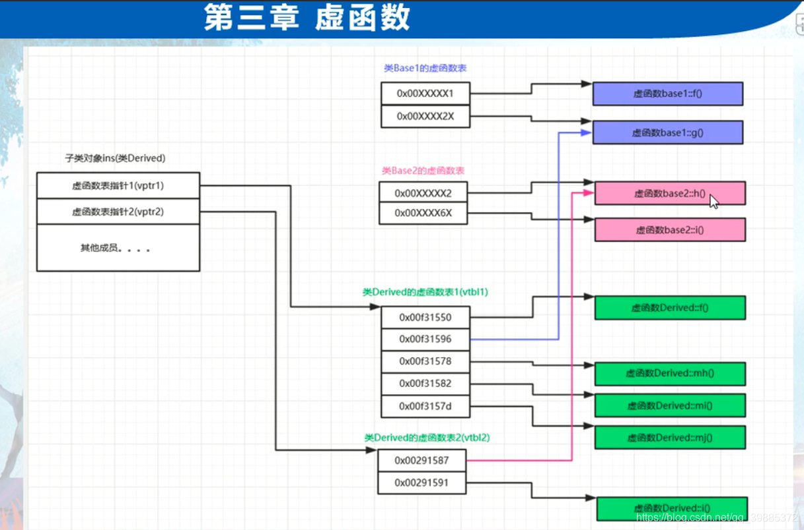

辅助工具，vptr、vtbl创建时机

windows：cl.exe：编译链接工具
cl /d1 reportSingleClassLayoutDerived project100.cpp

linux：g++ -fdump-class-hierarchy -fsyntax-only 3_4.cpp

vptr(虚函数表指针）什么时候创建出来的？
vptr跟着对象走，所以对象什么时候创建出来，vptr就什么时候创建出来。运行的时候；
实际上，对于这种有虚函数的类，在编译的时候，编译器会往相关的构造函数中增加 为vptr赋值的代码，这是在编译期间编译器为构造函数增加的。这属于编译器默默为我们做的事，我们并不清楚。

当程序运行的时候，遇到创建对象的代码，执行对象的构造函数，那么这个构造函数里有，给对象的vptr(成员变量)赋值的语句，自然这个对象的vptr就被赋值了；

虚函数表是什么时候创建的？
实际上，虚函数表是编译器在编译期间（不是运行期间）就为每个类确定好了对应的虚函数表vtbl的内容。
然后也是在编译器期间在相应的类构造函数中添加给vptr赋值的代码，这样程序运行的时候，
当运行到成成类对象的代码时，会调用类的构造函数，执行到类的构造
函数中的 给vptr赋值的代码，这样这个类对象的vptr(虚函数表指针)就有值了；
	   

```c++
// project100.cpp : 此文件包含 "main" 函数。程序执行将在此处开始并结束。
//

#include "pch.h"
#include <iostream>
using namespace std;

//基类1
class Base1
{
public:
	virtual void f()
	{
		cout << "base1::f()" << endl;
	}
	virtual void g()
	{
		cout << "base1::g()" << endl;
	}
};

//基类2
class Base2
{
public:
	virtual void h()
	{
		cout << "base2::h()" << endl;
	}
	virtual void i()
	{
		cout << "base2::i()" << endl;
	}
};

//子类
class Derived :public Base1, public Base2
{
public:
	virtual void f() //覆盖父类1的虚函数
	{
		cout << "derived::f()" << endl;
	}
	virtual void i() //覆盖父类2的虚函数
	{
		cout << "derived::i()" << endl;
	}

	//如下三个我们自己的虚函数
	virtual void mh()
	{
		cout << "derived::mh()" << endl;
	}

	virtual void mi()
	{
		cout << "derived::mi()" << endl;
	}

	virtual void mj()
	{
		cout << "derived::mj()" << endl;
	}
};


int main()
{	
	//多重继承
	cout << sizeof(Base1) << endl;
	cout << sizeof(Base2) << endl;
	cout << sizeof(Derived) << endl;

	Derived ins;
	Base1 &b1 = ins; //多态
	Base2 &b2 = ins;
	Derived &d = ins;

	typedef void(*Func)(void);
	long *pderived1 = (long *)(&ins);
	long *vptr1 = (long *)(*pderived1); //取第一个虚函数表指针。

	long *pderived2 = pderived1 + 1; //跳过4字。
	long *vptr2 = (long *)(*pderived2); //取第二个虚函数表指针。

	Func f1 = (Func)vptr1[0]; //0x00ab15d7 {project100.exe!Derived::f(void)}
	Func f2 = (Func)vptr1[1]; //0x00ab15f0 {project100.exe!Base1::g(void)}
	Func f3 = (Func)vptr1[2]; //0x00ab15cd {project100.exe!Derived::mh(void)}
	Func f4 = (Func)vptr1[3]; //0x00ab15ff {project100.exe!Derived::mi(void)}
	Func f5 = (Func)vptr1[4]; //0x00ab15eb {project100.exe!Derived::mj(void)}
	Func f6 = (Func)vptr1[5]; //非正常
	Func f7 = (Func)vptr1[6];
	Func f8 = (Func)vptr1[7];

	Func f11 = (Func)vptr2[0]; //0x00ab15af {project100.exe!Base2::h(void)}
	Func f22 = (Func)vptr2[1]; //0x00ab15b9 {project100.exe!Derived::i(void)}
	Func f33 = (Func)vptr2[2]; //非正常
	Func f44 = (Func)vptr2[3];

	b1.f();
	b2.i();
	d.f();
	d.i();
	d.mh();
	d.g();

	//----------------
	cout << "-----------------" << endl;
	f1();
	f2();
	f3();
	f4();
	f5();
	cout << "-------------" << endl;
	f11();
	f22();


	return 1;
}

```



